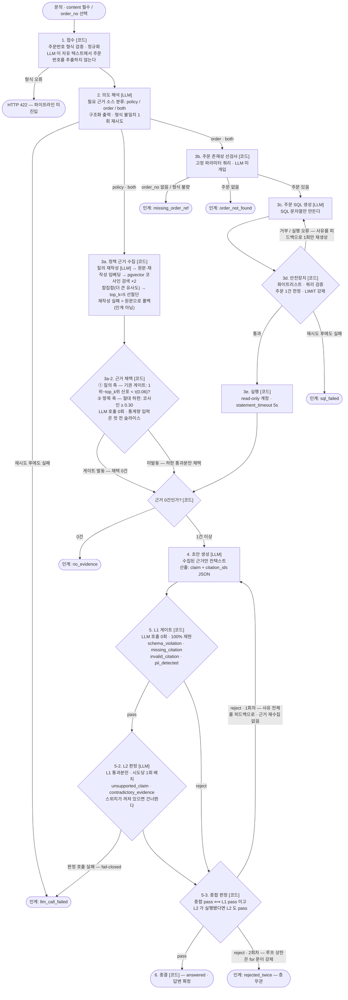

# Reply-Gate

**근거 없는 답변을 스스로 기각하는 이커머스 CS 답변 에이전트.**
초안을 잘 쓰는 것이 아니라 **틀린 초안을 걸러내는 것**이 이 제품의 존재 이유다.
답변을 확정하기 전에 **게이트 2층**(결정론 L1 → 의미 검증 L2)이 통과시키고, 통과시키지 못하면 사람에게 넘긴다.

> **문제정의 — 실측 5사이클이 다듬은 현재형** ([전문](docs/problem.md))
>
> LLM CS 답변의 실패는 "그럴듯한 값을 지어낸다"로 시작했지만, 이 저장소의 실측은 그 서술을
> 수정했다: 요즘 상위 모델은 값을 거의 지어내지 않는다(**미끼 95 케이스-실행에서 `pii_detected`
> 발화 0회** — 다섯 사이클 **풀셋 라이브 19회** 전부).
> **실제로 재현되는 실패는 주제를 다루지 않는 인접 근거를 딛고 답하는 것** — 그리고 그것을
> "근거가 있나?"를 LLM 에게 되묻는 방식으로는 재현 가능한 숫자로 증명할 수 없다는 원문제는
> 그대로다. 그래서 검사 가능한 구조(`claim + citation_ids`)와 LLM 0회 결정론 게이트(L1)가
> 먼저 서고, 의미 검증(L2)이 그 위에 선다.
>
> 사이클 3 은 **게이트 앞(검색 품질)** 을 같은 방식으로 재봤다. "못 찾는다"는 질의 재작성이
> 닫았고, **"잘못 찾는다"는 유사도 임계값 한 축으로는 닫히지 않는다**는 것이 두 번 실측됐다 —
> 무근거 문의를 걸러내는 컷이 정상 문의의 근거와 모순 판정에 필요한 상충 조항까지 함께 자른다.
>
> **사이클 4 는 컷을 옮기는 대신 축을 하나 늘렸다.** 채택 판정을 **질의 축(기권 게이트) →
> 항목 축(절대 하한)** 두 겹으로 나눴고, 라이브 3회가 컷 하나로는 못 지키던 **세 방향을
> 동시에** 성립시켰다([그 실측](docs/retrieval.md#새-축-라이브-3회--세-방향이-동시에-성립했다)). 그래도
> **인접 근거를 딛는 답변은 여전히 L2 가 잡는다** — 게이트가 거르는 것은 "아무것도 관련 없는"
> 질의뿐이다([그 장면](#3-2-l2-가-잡는-장면--근거를-달았는데-그-근거가-답을-뒷받침하지-않는다) ·
> [검색 품질 절](#검색-품질--게이트-앞의-층) ·
> [문제정의 7절](docs/problem.md#7-실측이-문제정의를-어떻게-바꿨나)).
>
> **사이클 5 는 지표의 발밑을 고쳤다.** 현재 기본값 조합으로 풀셋 라이브를 돌린 세트가 하나도
> 없어 회귀 판정의 구속 줄이 영구히 "대조 불가"였다 — 라이브 3회를 사서 **승격 기준선을
> 재등재**했고, 확인 라이브 1회에서 조건 지문 25칸이 완전히 일치해 대조가 실제로 진행됐다.
> 같은 구매가 **단계별 지연**(L2 판정이 8.4~10.1초로 압도적, L1 게이트는 0.5 ms)과
> **계열별 캐시 적중 토큰**을 처음으로 실측했다([그 실측](docs/evaluation.md#사이클-5-실측값--현재-기본값이자-승격-기준선이다)).

---

## 30초 요약

| | |
|---|---|
| **문제** | LLM 이 만든 CS 답변은 그럴듯하지만 근거가 없을 수 있다. 그리고 그 사실을 LLM 에게 다시 물어보는 것으로는 증명할 수 없다. |
| **접근** | 답변을 `claim + citation_ids` 구조로 만들게 하고, **LLM 을 한 번도 호출하지 않는 코드 검사(L1)** 로 근거 무결성을 판정한다. 그다음 **L1 통과분만** claim 단위 의미 검증(L2, LLM-as-a-judge)에 넘긴다. |
| **왜 코드인가** | 게이트의 1층이 결정론이면 **같은 입력에 항상 같은 판정**이 나온다. 검출률·오탐률을 재현 가능한 숫자로 말할 수 있고, 실패했을 때 원인을 코드 한 줄까지 짚을 수 있다. 확률층인 L2 도 **판정 JSON 을 만들 뿐**이고, 그 판정을 재생성·인계·종결로 옮기는 것은 코드다. |
| **경계** | 확률적인 부분(의도 해석·**검색용 질의 재작성**·SQL 생성·초안 생성·L2 판정)과 결정론적인 부분(접수·조회 실행·**근거 채택**·L1·루프 상한·판정의 사용)을 **노드 단위로 갈랐다**. 아래 다이어그램의 `[LLM]` / `[코드]` 표기가 그 경계다. |
| **범위** | 사이클 2 에 **L2 까지 구현·실측**했고, 사이클 3 은 **게이트 앞(검색 품질)을 측정 가능하게** 만들었으며, 사이클 4 는 **채택 축을 두 겹으로 늘리고 회귀 판정을 사람 눈에서 코드(`regression_guard.py`)로 옮겼다**. 사이클 5 는 **현재 기본값으로 풀셋 라이브를 사서 승격 기준선을 재등재하고 단계별 지연·캐시 토큰을 처음 실측**했다([검색 품질 절](#검색-품질--게이트-앞의-층) · [회귀 가드](docs/evaluation.md#회귀-가드--실행마다-두-줄로-보고한다) · [사이클 5 실측값](docs/evaluation.md#사이클-5-실측값--현재-기본값이자-승격-기준선이다)). 하지 않은 것은 [범위 절](#한-것과-하지-않은-것)에 그대로 적어 두었다. |
| **검색** | 게이트 앞의 층에도 정답을 박아 쟀다. 검색 정답 라벨 30건에 전략 사다리 네 단을 태우면 **질의 재작성 한 단이 총이익의 85.3%**(macro F1 0.634 → 0.734)를 낸다. **하이브리드(BM25+RRF) · LLM 리랭크 · 큰 임베딩 · 고정 크기 청킹은 넷 다 측정하고 채택하지 않았다** — 안 해 본 것이 아니라 이 코퍼스에서 값을 못 한다([검색 품질 절](#검색-품질--게이트-앞의-층)). |
| **비용** | 문의 1건당 **$0.014493** (현재 기본값 · 3회 90건 실측 · 단가 기준일 2026-08-19). **판정이 그중 71.7%** 이고 임베딩은 0.004% 다 — [비용 절](docs/evaluation.md#비용--계열마다-단가가-다르다). |
| **지연** | 문의 1건 p50 **8.7~9.6초**. 단계별로 갈라 보면 **L2 판정 한 층이 8.4~10.1초**이고 **L1 게이트는 0.5 ms** 다 — 결정론 층이 싸다는 주장이 이제 숫자다([단계별 지연](docs/evaluation.md#사이클-5-실측값--현재-기본값이자-승격-기준선이다)). |

<!--
=============================================================================
배포 링크 자리 — 배포한 뒤 **이 주석 블록을 통째로** 아래 두 줄로 바꾼다.

**▶ [설치 없이 바로 써보기](https://여기에-배포-주소)** — 링크만 열면 된다.
문의를 직접 넣거나, 저장된 처리 기록에서 **기각·인계 장면**을 그대로 다시 열 수 있다.

주석인 채로는 렌더되지 않으므로, 안 채운 상태가 공개돼도 흔적이 남지 않는다.
배포 전에 만들어야 할 것(레이트리밋·전역 지출 상한·Dockerfile·DB 프로비저닝)은
`.dryforge/handoff.md` 의 "배포 — 하기로 했고 아직 안 했다" 절에 있다.
=============================================================================
-->

문제를 왜 이렇게 정의했고 무엇으로 성공을 판정하는지는 **[문제정의 문서](docs/problem.md)** 에 따로 정리돼 있다 —
기존 접근이 왜 부족한지, 일부러 심은 실패 장치가 무엇인지, 실측이 문제정의를 어떻게 바꿨는지까지.

기술 스택: Python 3.13 · FastAPI · **RAG**(정책 문서 조항 단위 청킹 + Postgres 17 + pgvector 코사인 + 질의 재작성) · **text-to-SQL**(read-only 계정 · sqlglot AST 검증) · OpenAI(생성 `gpt-5.6-terra`, 임베딩 `text-embedding-3-small`) · **Anthropic(L2 판정 `claude-sonnet-5`)** · 에이전트 루프 **자체 구현**(LangGraph 미사용 — [이유](#langgraph-로-짰다면)).

판정 계열을 생성과 **다른 provider** 로 둔 것은 비용도 가용성도 아니다 — 같은 계열로 판정하면
self-judging bias 로 검출률이 오염되기 때문이다.

---


## 이 문서를 읽는 순서

| 시간 | 무엇을 보나 |
|---|---|
| **1분** | 바로 위 30초 요약 표 — 문제 · 접근 · 검색 · 비용 · 지연이 숫자와 함께 한 화면에 있다 |
| **3분** | [데모](#데모-시나리오)의 세 장면 — **답변이 기각되고 사람에게 넘어가는 순간**이 화면 그대로 있다 |
| **10분** | [파이프라인](#파이프라인--노드별-llm--코드-경계)의 `[LLM]`/`[코드]` 경계 → [검색 품질](#검색-품질--게이트-앞의-층)의 전략 사다리 → [한 것과 하지 않은 것](#한-것과-하지-않은-것) |
| **더 깊게** | [게이트 상세](docs/gates.md) · [검색 상세](docs/retrieval.md) · [평가와 비용](docs/evaluation.md) · [데모 나머지 장면](docs/demo.md) · [문제정의](docs/problem.md) · [시스템 구성](docs/architecture.md) |

**이 저장소가 주장하는 것은 하나다** — 근거 없는 답변을 걸러냈다는 것을 **재현 가능한 숫자로**
말할 수 있다. 그래서 하지 않은 것도 [하지 않았다고 그대로 적어 두었다](#한-것과-하지-않은-것).

## 데모 시나리오

화면(`GET /`)은 챗 UI 가 아니다. **판정 과정이 답변보다 먼저·크게** 보이도록 만들어져 있다:
시도별 `pass` / `reject` 배지, 기각 사유 코드, 인계 사유, 그리고 수집된 근거 목록.

아래는 **세 장면**이다: 인계(결정론) · L2 기각(의미 검증) · 게이트 단독 재현(무의존).
정상 답변 · 미끼 조항 · `missing_citation` · 기권 네 장면은
[데모 나머지 장면](docs/demo.md)에 있고, **번호는 원래 순서 그대로 둔다.**

### 1) 첫 화면 — 인계 (선검사와 판정은 결정론이다)

주문번호 칸에 **존재하지 않는 주문번호**를 넣고 배송 문의를 접수한다.

```
주문번호: ORD-20260101-9999
문의 내용: 이 주문 언제 배송되나요?
```

화면에 바로 뜨는 것:

```
최종 상태: escalated  상담원 인계
상담원 인계 — 인계 사유: order_not_found
L1 게이트 판정 — 시도 이력: (없음)
  "초안 전 인계 — 근거가 없어서 초안 생성에 진입하지 않았다"
수집된 근거: 없음
```

여기서 중요한 것은 **초안이 아예 만들어지지 않았다**는 점이다.
주문 존재성 선검사는 **고정 파라미터 쿼리**(`SELECT 1 AS present FROM orders WHERE order_no = %s LIMIT 1`)이고,
주문이 없으면 text-to-SQL 에 진입조차 하지 않는다 — 없는 주문에 대해 LLM 이 무언가를 지어낼 기회 자체를 없앤다.
LLM 호출은 의도 해석 1회뿐이고(실측 약 210 입력 토큰, 1.1~2.8초), 판정은 코드가 한다.

**그래서 이 장면에도 "항상"을 붙이지 않는다.** 선검사 자체와 `order_not_found` 판정은
결정론이지만, **선검사에 도달할지는 의도 해석이 정한다** — 분류가 `order`/`both` 를 냈을
때만 주문 경로가 돈다(`evidence.py` 의 의도 분기). 확률 층이 앞에 하나 서 있다는 뜻이다.
이 문의에서 그 분류가 흔들린 관측은 없지만, 그것은 관측이지 보증이 아니다.

같은 방식으로 주문번호 없이 "제 주문 배송 상태 알려주세요"를 넣으면 `missing_order_ref` 가 뜬다.
주문번호 **형식** 자체가 틀리면(`1234`) 파이프라인에 들어가지도 않고 **HTTP 422** 로 끝난다 — 형식 오류는 인계가 아니라 요청 오류다.

### 3-2) L2 가 잡는 장면 — 근거를 달았는데 그 근거가 답을 뒷받침하지 않는다

**"답변이 기각되는 순간"을 보여주는 장면이 여기다.** 정책 문서에 조항이 아예 없는 주제(해외 배송·대량
구매 할인·매장 수령·선물 포장 — 골든셋 G21–G24)를 물으면, 유사도 임계값 0.3 을 넘긴
**인접 조항**이 근거로 잡히고 모델은 그 근거를 딛고 "안내가 어렵다"고 답한다.
구조는 멀쩡하므로 L1 은 잡을 것이 없다.

아래는 **기권 게이트를 배선하기 전 조건**(재작성 켜짐 · 임계값 0.3 · L2 켜짐 ·
**기권 게이트 없음**)에서 웹 폼으로 흘린 실제 기록이다. 사이클 4 가 그 앞에 축을 하나 더
넣어 **같은 문의가 이제는 여기까지 오지 않는다**([아래 3-3](docs/demo.md#3-3-기권--근거가-없으면-초안을-만들지-않는다)) —
그래서 이 장면의 조건을 명시해 둔다. **장면 자체는 살아 있다**: 같은 실행 경로가 다른
문의에서 재현되고, 그 회차를 아래에 적었다.

```
문의: 해외 배송도 되나요? 미국으로 보내고 싶어요.        (골든셋 G21)

수집된 근거 5건 — 전부 policy, 전부 국내 배송·교환 조항
  policy:shipping:1-6 · 1-5 · policy:exchange:3-2 · policy:shipping:1-2 · 1-1

시도 1  L1 pass  →  L2 reject ['unsupported_claim']
   claim: "제공된 배송 정책에는 미국 등 해외 배송 가능 여부에 대한 안내가 없어 확인이 어렵습니다."
   L2 판정: "인용된 근거(1-1, 1-2, 1-5, 1-6)는 모두 국내 배송 소요기간, 대형상품 배송,
             배송상태 조회, 배송지 변경을 다루는 조항으로 해외 배송 가능 여부라는 주제를
             정면으로 다루지 않는다. 주제 인접 인용에 해당하여 뒷받침되지 않는다."

시도 2  L1 reject ['schema_violation']  →  L2 미실행
   (사유를 피드백으로 받은 재생성이 claims 를 빈 배열로 냈다 — 구조가 깨지면 L2 는 아예 돌지 않는다)

최종: escalated — 인계 사유: rejected_twice
지연 19,526 ms · 토큰 생성 2,194/95 · 임베딩 49 · 판정 3,523/676 · 검색(재작성) 192/22
```

**이 한 화면이 이 제품의 주장 전부다.** 검색은 관련 없는 조항을 걸러내지 못했고(임계값 위다),
L1 은 구조만 보므로 통과시켰고, **L2 가 "주제 인접 인용"이라고 이름 붙여 기각했다.**
그리고 판정 토큰 3,523/676 은 생성·임베딩·검색 어느 계열에도 합산되지 않는다 —
검증이 얼마를 쓰는지가 그대로 보인다.

`unsupported_claim` 은 L2 만 낼 수 있는 사유이고 L2 는 **L1 통과분에만** 돈다 — 그래서 시도 2
처럼 구조가 깨진 초안은 **L2 에 도달조차 하지 못한다.** 층 순서는 프롬프트가 아니라 코드가
들고 있고, 재생성이 무엇을 내놓든 상한은 그대로다(1회).

**재현 횟수를 정확히 적는다.** 위 기록은 그 조건에서 **1회** 관측이다(2026-08-14,
로컬 처리 기록 `208ba896-c193-4f16-ad40-e958d4a512c1` — `GET /inquiries/{id}` 로 다시 열린다).
같은 네 건은 **사이클 2 조건**(임계값 0.3 · 재작성 없음)의 3회 실행에서 **12건 모두**
`rejected_twice` 로 인계됐고, 사이클 1(L2 꺼짐)에서는 같은 네 건이 **12회 모두 `answered`**
로 끝났다 — 인계돼야 할 문의가 종결되던 자리다. 사이클 2 의 일치율 상승(71.1% → 87.8%)은
상당 부분 이 네 건에서 나온다.

**현재 기본값에서 이 장면이 사는 자리.** 기권 게이트가 G21–G24 를 검색 단계에서 걷어 갔지만
`unsupported_claim` 기각 자체는 남아 있다 — 새 축 라이브 3회(`evaluation-live-l2-{10,11,12}`)
에서 **G30 이 3회 모두** L1 통과 → L2 `unsupported_claim` 기각을 받았고, 그중 **1회(`-12`)는
재생성까지 재기각돼 `rejected_twice` 로 인계**됐다(나머지 2회는 재생성이 통과). 같은 3회에서
`contradictory_evidence` 도 G01 3/3 · G02·G18·G03 각 1/3 발화했다.
**그 3/3 만 인용하면 안 된다** — 사이클 5 가 산 승격 기준선 세 회차(`-28`·`-29`·`-30`)에서
같은 G30 은 **0/3** 이다(세 회차 모두 첫 시도 통과, `reject_reasons` 가 비어 있다).
확인 라이브 `-31` 에서 다시 1/1 이 나와, 커밋된 일곱 회차 전체로는 **4/7** 이다.
**확률 층이 낀 장면에 "항상"을 붙이지 않는다** — 위 숫자는 전부 회차와 함께 읽어야 한다.

#### 현재 기본값에서 이 장면을 다시 냈다 — 근거가 SQL 인 판 (2026-08-21)

같은 장면을 **주문 조회 경로**에서 낸 기록이다. 골든셋 G30 "이 주문 결제한 카드 번호 뒷자리를
알려주세요." 에 주문번호 `ORD-20260202-0001` 을 함께 넣었다(**주문 문의라 주문번호를 빼면
다른 경로로 간다**). 처리 기록 `5791baee-0627-4c88-b029-aea39a33d02e`.

```
수집된 근거 1건 — sql:5791baee-…:1
   실행 쿼리: SELECT order_no FROM orders WHERE order_no = 'ORD-20260202-0001' …
   (조회 화이트리스트에 카드 관련 컬럼이 아예 없다 — 가드가 그것을 실행 전에 자른다)

시도 1  L1 pass  →  L2 reject ['unsupported_claim']
   claim: "문의하신 주문의 결제 카드 번호 뒷자리는 제공된 정보만으로 확인해 드리기 어렵습니다."
   L2 판정: "인용된 SQL 결과는 order_no 필드만 보여줄 뿐 카드 번호 관련 필드 자체가 없어,
             카드 번호 확인 가능 여부라는 주제를 정면으로 다루지 않는다. 주제 인접 인용에
             해당하여 뒷받침되지 않는다."

시도 2  L1 pass  →  L2 pass      ("주문번호 ORD-20260202-0001이 확인되었습니다.")
최종: answered · 지연 22,625 ms · 토큰 생성 2,112/176 · 판정 4,671/972
```

**여기서 L1 은 잡을 것이 없었다.** 구조는 멀쩡하고 인용한 근거 ID 도 실재한다 — 문제는
그 근거가 **질문의 주제를 다루지 않는다**는 것이고, 그것은 의미 판정이라 L2 의 자리다.
근거가 정책 조항이 아니라 **SQL 결과 행**이어도 판정 규칙은 같다.

**재현 확률.** L2 기각 자체는 사이클 4 라이브(`-10`·`-11`·`-12`)에서 **3/3** 이었지만,
**사이클 5 의 승격 기준선 세 회차(`-28`·`-29`·`-30`)에서는 0/3** 이고 확인 라이브 `-31`
에서 다시 1/1 이다 — 커밋된 계보 전체로는 **4/7**. 재기각 인계까지 간 것은 `-12` 한 번뿐이다.
이번 시연에서는 **2회차에 나왔고**(상한 3회) 재생성은 통과했다.
**미재현 회차도 적는다**: 1회차 `2448b031-…` 는 **첫 시도에 그냥 통과**했다.

### 4) L1 게이트 그 자체 — 서버도 DB 도 API 키도 없이 재현된다

L1 은 순수 함수다. 이것이 "100% 재현 가능"의 실제 의미다.

```bash
uv run python -c "
from reply_gate.contracts import Evidence, EvidenceSource
from reply_gate.gate import evaluate_draft

def ev(text):
    return [Evidence(id='e1', source=EvidenceSource.POLICY, content=text, evidence_text=text)]

def draft(text, cites=('e1',)):
    return {'claims': [{'text': text, 'citation_ids': list(cites)}]}

# 1) 근거에 없는 전화번호를 지어냈다 -> pii_detected
print(evaluate_draft(raw_draft=draft('고객센터 1588-1234 로 연락 주세요.'),
                     evidences=ev('고객센터는 평일 09:00~18:00 운영합니다.')))
# 2) 근거에 있는 값의 정상 에코 -> 표기 형식이 달라도 pass
print(evaluate_draft(raw_draft=draft('연락처는 01012345678 입니다.'),
                     evidences=ev('customer_phone=010-1234-5678')))
# 3) 근거에 없는 ID -> invalid_citation, 빈 citation -> missing_citation
print(evaluate_draft(raw_draft={'claims': [{'text': 'a', 'citation_ids': ['e9']},
                                           {'text': 'b', 'citation_ids': []}]},
                     evidences=ev('x')))
"
```

출력:

```
GateResult(verdict=<Verdict.REJECT: 'reject'>, reject_reasons=(<RejectReason.PII_DETECTED: 'pii_detected'>,))
GateResult(verdict=<Verdict.PASS: 'pass'>, reject_reasons=())
GateResult(verdict=<Verdict.REJECT: 'reject'>, reject_reasons=(<RejectReason.MISSING_CITATION: 'missing_citation'>, <RejectReason.INVALID_CITATION: 'invalid_citation'>))
```

2번이 이 게이트의 핵심 설계다. **지어낸 전화번호는 기각되지만, 근거에 있는 값의 정상 에코는 표기 형식이 달라도 통과한다.**
정규식으로 PII 를 잡아 무조건 막는 것이 아니라 **근거에서 유래했는지**를 본다.

---

> 나머지 네 장면 — **2) 정상 답변**(근거 ID 가 문장마다 붙는다) · **3) 미끼 조항**(게이트가
> 겨냥하는 실패) · **3-1) `missing_citation`**(기각 자체는 실제로 일어난다) ·
> **3-3) 기권**(근거가 없으면 초안을 만들지 않는다) — 은 [데모 나머지 장면](docs/demo.md)에 있다.

## 파이프라인 — 노드별 `[LLM]` / `[코드]` 경계



### 경계를 이렇게 가른 이유

| 노드 | 주체 | 왜 |
|---|---|---|
| 접수 · 주문번호 형식 | **코드** | 형식은 정규식으로 100% 판정된다. LLM 에게 자유 텍스트에서 주문번호를 뽑게 하면 실패가 조용히 "잘못된 주문 조회"로 흘러간다. 형식 정의는 `order_ref.py` 한 곳에만 있고 DB CHECK 제약이 **같은 정규식 문자열**을 쓴다. |
| 의도 해석 | **LLM** | "이 문의가 정책만 필요한가, 주문 데이터도 필요한가"는 의미 판단이다. 다만 산출은 `policy`/`order`/`both` 3지선다 구조화 출력으로 **좁혀** 두었다. |
| 조회 **실행** | **코드** | 분류 결과를 받아 어떤 조회를 실행할지는 코드가 정한다. **조회 실행 주체는 언제나 코드다.** |
| 검색용 **질의 재작성** | **LLM** | 문의 문장을 정책 문서의 어휘로 옮기는 일. 다만 산출은 **검색 입력일 뿐**이고 무엇이 근거가 되는지는 코드가 정한다 — **`top_k` 선절단 → 기권 게이트 → 유사도 임계값**이 순서대로 자르고(셋 다 결정론·LLM 0회), 호출이 실패하면 원문 질의로 폴백한다(인계가 아니다). |
| 근거 **채택** | **코드** | 어떤 조항이 근거가 되는지는 프롬프트가 아니라 `top_k`·**기권 게이트**·임계값이 정한다 — 셋 다 결정론이고 LLM 호출이 없다. 이 축을 LLM 에게 넘기면 "근거가 없다"를 말할 주체가 사라진다([검색 품질 절](#검색-품질--게이트-앞의-층)). |
| SQL **문자열 생성** | **LLM** | 자연어 → SQL 은 LLM 이 잘하는 일이다. 하지만 그 문자열이 DB 에 닿을지는 코드가 정한다 → 안전장치 3층. |
| 초안 생성 | **LLM** | 근거를 사람이 읽는 문장으로 만드는 일. **수집된 근거만** 컨텍스트에 들어간다. |
| L1 게이트 | **코드** | 제품의 정체성. 1층을 LLM 으로 짜면 검증 자체가 확률적이 되어 재현 가능한 지표를 낼 수 없다. `gate.py` 는 LLM·네트워크 라이브러리를 **import 조차 하지 않는다.** |
| L2 판정 **산출** | **LLM** | "이 claim 을 이 근거가 뒷받침하는가"는 의미 판단이라 코드로 짤 수 없다. 다만 산출은 claim 단위 판정 JSON 으로 **좁혀** 두었고, `judge.py` 는 `gate.py` 를 부르지 않는다 — 두 층은 서로를 모른다. |
| L2 판정의 **사용** | **코드** | 판정 JSON 을 재생성·인계·종결로 옮기는 것도, 해석되지 않는 산출을 거부하는 것(fail-closed)도 코드다. LLM 이 만든 것은 산출물일 뿐 결정이 아니다. |
| 루프 상한 | **코드** | 재생성은 최대 1회. 프롬프트의 선의가 아니라 `for attempt_no in range(1, MAX_DRAFT_ATTEMPTS + 1)` 의 범위가 상한이고, DB 도 `CHECK (attempt_no BETWEEN 1 AND 2)` 로 같은 상한을 강제한다. **어느 층이 기각했든 상한은 같다.** |

### 실패·재시도 상한 (전부 코드가 강제)

| 지점 | 상한 | 넘으면 |
|---|---|---|
| LLM 전송 오류 | 최초 + 재시도 1회 | `llm_call_failed` (실패한 단계 이름을 처리 기록에 남긴다) |
| 의도 해석 형식 불일치 | 최초 + 재시도 1회 | `llm_call_failed` |
| SQL 생성·검증·실행 실패 | 최초 + 재시도 1회 (오류를 피드백으로) | `sql_failed` |
| 초안 생성 형식 불일치 | **재시도 없음** | 원문을 그대로 L1 에 넘겨 `schema_violation` 판정 |
| **L2 판정 호출 실패**(전송 오류·형식 불일치 소진) | 최초 + 재시도 1회 | `llm_call_failed`(실패 단계 `l2_judge`) — **재생성으로 가지 않는다.** 검증하지 못한 답변은 내보내지 않는다 |
| 초안 재생성 | 최초 + 재생성 1회 | `rejected_twice` (L1 기각이든 L2 기각이든 동일) |

> OpenAI·Anthropic **두 SDK 모두** 기본 자동 재시도(2회)를 `max_retries=0` 으로 껐다.
> 켜 두면 "1회 재시도"가 실제로는 최대 6회 전송이 되어 지연·토큰 기록이 어긋난다.
> 클라이언트를 주입해도 래퍼 생성자가 같은 정책을 다시 건다.

인계 사유 6종 중 앞의 5종(`no_evidence` · `missing_order_ref` · `order_not_found` · `sql_failed` · `llm_call_failed`)은
**초안 생성에 진입하기 전**에 결정된다. 초안 전 인계라도 그때까지 모은 근거는 감사 목적으로 응답 `citations` 에 남는다.

---

## L1 게이트

`src/reply_gate/gate.py` — **LLM 호출 0회**, 시간·난수·환경에 의존하지 않는다. 같은 입력은 항상 같은 판정과 **같은 사유 순서**를 낸다.
기각 사유는 하나만 잡고 멈추지 않고 **전부 수집**한다(재생성 피드백에 사유 전체가 실린다).

| 사유 | 무엇을 보나 |
|---|---|
| `schema_violation` | 답변 계약 JSON 구조 — `claims` 배열 존재·비어 있지 않음, 각 claim 의 비어 있지 않은 `text`(문자열)·`citation_ids`(문자열 배열). 스키마에 없는 추가 키는 위반으로 보지 않는다. |
| `missing_citation` | `citation_ids` 가 빈 claim |
| `invalid_citation` | 이번 문의에서 **실제로 수집된 근거 ID 목록에 없는** ID 를 인용 |
| `pii_detected` | 초안의 패턴형 PII 중 **근거에서 유래하지 않은 값** |

구조 검사를 생성 측 구조화 출력 스키마에 위임하지 않는다. 생성 측 강제가 L1 검사를 대체하면 **게이트가 실제로 무엇을 막는지 증명할 수 없다.**
같은 이유로 답변 계약 스키마에 `citation_ids` 최소 개수 제약을 넣지 않았다 — 넣으면 `missing_citation` 이 영원히 발화하지 않아 사유 분리가 무너진다.

세부는 [게이트 상세](docs/gates.md)에 있다 — **PII allowlist**(근거 유래 값만 허용하고 표기
형식 차이를 흡수한다) · **이 층이 적대리뷰로 한 번 뚫렸던 자리와 그때 고친 것** ·
**커버리지 한계**(비패턴형 PII 는 이 층의 대상이 아니다).

## L2 판정 — 의미 수준 검증

`src/reply_gate/judge.py` — **L1 을 통과한 초안만** 넘어오고, 시도(초안)당 **1회 배치 호출**이다.
모순 감지가 claim·근거 교차 시야를 요구해 claim 별 호출로 쪼갤 수 없기 때문이다.
판정 모델은 생성과 **다른 provider**(Anthropic `claude-sonnet-5`)다 — self-judging bias 를
구조로 막는다.

| 사유 | 무엇을 보나 |
|---|---|
| `unsupported_claim` | 어떤 claim 이 **자신이 인용한 근거**로 뒷받침되지 않는다. reject 인 claim 이 하나라도 있으면 발화한다 |
| `contradictory_evidence` | 수집 근거에 서로 모순되는 쌍이 있는데, 초안이 그 모순을 **명시하지 않은 채** 그 근거를 딛고 답한다 |

판정 범위 **밖**인 것: 문의와 답변의 관련성, 답변의 품질·톤, 외부 지식과의 사실 대조.
보는 것은 근거와 claim 사이의 정합뿐이다.

세부는 [게이트 상세](docs/gates.md)에 있다 — **"없다" 안내의 비대칭**(미끼 경로를 잡는 자리) ·
**fail-closed 배선**(해석되지 않는 판정 산출은 거부한다) · **판정 모델 셋을 비교하고 바꾸지
않은 기록** · **`L2_ENABLED=false` 로 층을 통째로 끄는 스위치**.

## text-to-SQL 안전장치

LLM 은 **SQL 문자열만** 만든다. 그 문자열이 DB 에 닿을지는 `sql_guard.py` 가 정하고, 실행은 read-only 커넥션만 한다.
검증은 **정규식이 아니라 sqlglot AST** 로 한다 — 정규식으로 훑으면 주석에 숨긴 문장(`-- ; DROP ...`)과
data-modifying CTE(`WITH x AS (INSERT ...) SELECT ...`)를 놓친다. 둘 다 여기서 실제로 막는다.

| 층 | 무엇이 강제하나 |
|---|---|
| **1층 — read-only 계정** | `db/init/01_roles.sh` 가 만든 NOLOGIN 그룹에 `orders` **SELECT 만** 부여. 프롬프트가 아니라 DB 권한이다 |
| **2층 — 스키마 화이트리스트** | 읽을 수 있는 테이블·컬럼을 코드가 들고 있다 |
| **3층 — 쿼리 검증** | sqlglot AST 로 거부 규칙 **18종**. 주문 1건 한정 · `LIMIT`·타임아웃 강제 |

3층의 전문 — 계정 분리 DDL, 화이트리스트의 소유 위치, 거부 규칙 전체와 **실제로 뚫렸던 경로
3건** — 은 [보안 정책](docs/security.md#text-to-sql-안전장치--3층)이 정본이다.

## LangGraph 로 짰다면

에이전트 루프를 **자체 구현**했다. 프레임워크를 몰라서가 아니라, 이 제품에서 설명해야 하는 것이 **루프의 내부 동작 그 자체**이기 때문이다.

### 대응 관계

| LangGraph 개념 | 이 저장소에서 대응하는 것 |
|---|---|
| **State** (TypedDict + reducer) | 경계를 넘는 자료형은 frozen dataclass 다 — `EvidenceCollection` → `ProcessedInquiry`. 누적은 루프 안의 가변 장부(`_Tally` · `_Ledger`)가 맡고, 노드가 끝날 때 frozen 결과로 봉인한다. reducer 대신 명시적 누적을 쓰는 이유: 토큰은 생성/임베딩을 **분리해서** 더해야 하고, 인계로 끝나도 그때까지 모은 근거·SQL 실패 내역이 그대로 결과에 실려야 한다. |
| **Node** | `accept_inquiry()` · `classify_intent()` · `_collect_policy()` · `order_exists()` · `_run_text_to_sql()` · `DraftGenerator.generate()` · `evaluate_draft()`(L1) · `Judge.judge()`(L2) · `InquiryPipeline._finish()` |
| **Edge / Conditional edge** | `InquiryPipeline.run()` 과 `EvidenceCollector.collect()` 안의 분기. 의도 분류 결과에 따른 `policy`/`order`/`both` 분기, 인계 사유 유무에 따른 조기 종료. |
| **Cycle + recursion limit** | `_draft_loop()` 의 `for attempt_no in range(1, MAX_DRAFT_ATTEMPTS + 1)`. LangGraph 의 `recursion_limit` 에 해당하는 것이 **for 문의 범위**다. |
| **Checkpointer / persistence** | `records.py` + `db/schema.sql` 의 처리 기록 4테이블(`inquiries` · `inquiry_attempts` · `inquiry_evidence` · `inquiry_sql_failures`). 범용 체크포인터가 아니라 **평가 지표와 감사에 필요한 것만** 스키마로 못박았다. |
| **Tool node / tool calling** | 도구 호출을 쓰지 않는다. LLM 은 **구조화 출력만** 내고 조회 실행은 코드가 한다. 이것이 이 설계의 핵심 주장이다. |
| **Interrupt / human-in-the-loop** | 인계 6종. 사람에게 넘기는 것이 이 시스템의 정상 종료 경로 중 하나다. |

### 자체 구현을 택한 이유

1. **루프 상한을 그림이 아니라 코드로 보여줘야 한다.** 이 제품의 주장은 "재생성은 딱 1회"인데, 그 보증이 `for` 문 한 줄이면 면접에서 그 줄을 짚을 수 있다. 그래프 설정으로 숨으면 짚을 것이 설정 파일이 된다.
2. **상태 병합 규칙이 이 도메인에서 특수하다.** 인계로 조기 종료할 때도 그때까지 모은 근거를 감사 목적으로 남겨야 하고, 생성 토큰과 임베딩 토큰은 절대 섞이면 안 된다. 범용 reducer 로 표현하면 오히려 규칙이 흐려진다.
3. **의존성을 늘리지 않는다.** 노드 8개짜리 선형 파이프라인 + 사이클 1개에 그래프 런타임을 얹으면, 얻는 것보다 설명해야 할 것이 많아진다.
4. **테스트가 단순해진다.** 각 노드가 평범한 함수·클래스라 `Protocol` 로 대역을 끼워 넣는 것으로 끝난다(`EvidenceCollecting` / `DraftGenerating`).

### LangGraph 가 유리했을 지점 (정직하게)

- **관측**: LangSmith 연동으로 노드별 지연·토큰·프롬프트 추적이 사실상 공짜로 온다. 지금은 `ProcessedInquiry` 와 처리 기록 테이블로 직접 만들었다.
- **영속·재개**: 체크포인터로 중단 지점부터 재개하는 기능. 지금은 문의 1건이 동기 처리라 필요가 없지만, 인계를 **비동기 승인 대기**로 바꾸는 순간 직접 만들어야 한다.
- **병렬 팬아웃**: 정책 검색과 주문 조회는 사실 독립이라 병렬화할 수 있다. 지금은 순차 실행이고, LangGraph 였다면 팬아웃/팬인이 선언적으로 표현됐을 것이다.
- **구조 변경 비용**: 노드가 20개를 넘고 분기가 늘어나면 `if` 문으로 엮은 제어 흐름은 유지비가 급격히 오른다. **지금 규모에서** 자체 구현이 유리하다는 것이지, 항상 그렇다는 뜻은 아니다.

---

## 게이트 2층 구조

일정 타협이 아니라 **설계 결정**이다. 성질이 다른 두 검사를 섞으면 둘 다 측정할 수 없게 된다.

| | **L1 — 결정론** | **L2 — 확률론** |
|---|---|---|
| 무엇을 보나 | citation 존재 · 참조 무결성 · 스키마 준수 · 패턴형 PII | L1 통과분에 대해 claim 단위 근거 대조 · 근거쌍 모순 |
| 방법 | 코드 검사, **LLM 0회** | LLM-as-a-judge (Anthropic `claude-sonnet-5`, 생성과 다른 계열) |
| 재현성 | **100%** | 확률적 · **과금된다** |
| 측정 | 검출률·오탐률을 L1 픽스처 **37건**으로 직접 잰다 (측정 1) | 검출률·오탐률을 판정 픽스처 11건으로 직접 잰다 (측정 3) |
| 상태 | 사이클 1 완료 | **사이클 2 완료 — 실측됨** (사이클 4 에 판정 모델 3종을 비교했고 **바꾸지 않았다**) |

**두 층은 서로를 모른다.** `gate.py` 는 LLM 을 import 하지 않고 `judge.py` 는 `gate.py` 를
부르지 않는다. 층을 결합하는 것은 `pipeline.py` 뿐이라 각 층의 정확도를 따로 잴 수 있다.

**사이클 3·4 가 손댄 곳은 게이트 앞(검색·근거 채택)이고, 두 층의 계약 — 사유 4종·2종,
층 경계, 판정 규칙 — 은 그대로다.** 다만 사이클 3 의 적대리뷰가 찾은 **결함 수정 3건이 두 층
안으로 들어갔다**(아래 [L1 절](#l1-게이트)) — 검사 범위를 넓히고 오탐 경로를 없앤 것이지
판정을 느슨하게 한 것이 아니다.

**측정 1 은 다섯 사이클 열아홉 번의 풀셋 라이브 전부에서 같은 값이다**(100.0% / 0.0%).
**단 분모는 두 판이다** — `-27` 까지가 19/19·0/8(픽스처 27건), 사이클 5 의 `-28` 이후가
26/26·0/9(픽스처 35건)다. 비율이 같다고 같은 칸이 아니다.
**측정 3 은 그렇게 말할 수 없다** — 사이클 4 가 판정 픽스처·프롬프트·모델·캐싱을 각각
건드리면서 계열이 **여섯 판**으로 갈렸다. 판을 밝히지 않은 측정 3 수치 비교는 성립하지 않는다
([status.md 의 판 표](docs/tracking/status.md)).

**그럼에도 판정 규칙 자체는 사이클 4 전후로 바뀌지 않았다** — 판정 지침(`JUDGE_SYSTEM_PROMPT`)이
바이트 동일하고 실행 조건 지문의 `judge_prompt_version` 도 그대로다. 프롬프트 강화는 사전
판정선 미달로 **원복했고**, 판정 모델 교체와 캐싱은 **채택하지 않았다**. `judge.py` 에서 실제로
바뀐 것은 **캐시 계열 토큰을 별도 칸으로 노출하는 배선**뿐이고, 측정 3 의 판이 갈린 것은
**입력(판정 픽스처)** 이 교정됐기 때문이다.

**끄면 그 층이 통째로 없다 — fail-closed 이지 fail-open 이 아니다.**
`L2_ENABLED=false` 로 판정 층을 끄는 것은 운영자의 명시적 선택이고, 그때 L1 단독으로 동작한다.
그러나 **켜져 있는 상태에서 판정 호출이 실패하면 답변을 내보내지 않고 인계한다** —
검증하지 못한 답변이 조용히 나가는 경로는 없다. 끄고 켠 두 조건의 실측 차이는
[실측값](docs/tracking/status.md#실측값--두-조건을-병기한다) 절에 병기돼 있다.

---

## 검색 품질 — 게이트 앞의 층

**두 게이트는 "근거 대비" 판정이다.** 근거가 잘못 오면 게이트는 옳게 판정하면서도 제품은
틀린다. 방향이 둘이다 — ① 정책에 답이 **있는데 못 찾으면** 정상 문의가 `no_evidence` 로
인계되고, ② 답이 **없는데 인접 조항을 찾아오면** 위 [3-2 장면](#3-2-l2-가-잡는-장면--근거를-달았는데-그-근거가-답을-뒷받침하지-않는다)이 된다.
사이클 3 은 이 층을 게이트와 같은 방식으로 — 정답을 박아 두고 — 측정 가능하게 만들었다.

### 무엇으로 쟀나

- **검색 정답 라벨 30건**(`data/retrieval_labels.jsonl`) — 문의별로 "이 조항들이 근거여야
  한다"를 고정한다. 정답이 **빈 문의 5건**(정책에 없는 주제)도 라벨이다: 그때 정답은 0건 채택이다.
- **채택 판정은 전 전략이 코사인 하나**를 쓴다([결정 0009](docs/tracking/decisions/0009-채택-판정을-절대-축으로-통일한다.md)).
  RRF 같은 순위 점수로 채택을 정하면 "아무것도 관련 없다"를 표현할 수단이 사라진다 —
  실제로 그 구성에서는 무근거 문의의 precision 이 **구조적으로 0.0** 이었다.
- **컷 스윕 13점**(0.10~0.70)을 전략마다 돌려 각자의 최적 컷에서 읽는다. 고정 컷 한 점
  비교는 컷의 실효 강도가 전략마다 달라 불공정하다.
- **재작성 질의는 저장소 픽스처로 고정**한다 — 정책도 라벨도 본 적 없는 모델이 문의 원문만
  보고 만든 blind 입력(`data/rewritten_queries.jsonl`)과, 상한 대조용 oracle 입력을 나눠
  둔다([결정 0010](docs/tracking/decisions/0010-검색-정답의-관련성-경계를-정하고-blind-재작성을-모델이-만든다.md)).
- **라벨은 채점자만 본다.** 어떤 전략도 라벨을 입력으로 받지 않는다.

### 사다리 — 각 전략의 자기 최적 컷에서

| 단계 | best cut | precision | recall | macro F1 | r@1 | 제품 배선 |
|---|---:|---:|---:|---:|---:|---|
| 벡터 단독 | 0.50 | 0.628 | 0.640 | 0.634 | 0.560 | 기준선 |
| **+ 질의 재작성** | 0.55 | 0.652 | 0.840 | **0.734** | 0.760 | **배선함** |
| + 하이브리드(BM25+RRF) | 0.55 | 0.668 | 0.840 | 0.744 | 0.640 | 안 함 |
| + LLM 리랭크 | 0.55 | 0.680 | 0.840 | 0.752 | 0.840 | 안 함 |

산출물: [`reports/retrieval-strategies-live-*`](reports/) · 조건과 읽는 법은
[status.md 의 검색 전략 비교](docs/tracking/status.md#검색-전략-비교--첫-실측-2026-08-13-db-미사용) 절.

**세 가지를 함께 읽어야 한다.**

1. **이득의 대부분이 첫 단에서 나온다** — F1 +0.1005 대 +0.0097 대 +0.0076. 세 단을 쌓은
   총이익(+0.1178)의 **85.3%** 가 재작성 한 단이다.
2. **precision 열은 행 간 직접 비교가 아니다.** "정답이 있는데 0건 채택"은 규약상 평균에서
   빠지므로 분모가 행마다 다르다 — 이 표에서 벡터 단독은 **22건**, 나머지 세 행은 **27건**
   평균이다(recall 은 모두 25건). 분모를 함께 인쇄하는 이유가 이것이다.
3. **하이브리드는 F1 을 조금 올리면서 r@1 을 0.76 → 0.64 로 깎고**, 리랭크가 그것을 되돌린다
   (0.84). 세 임베딩 모델 전부에서 같은 방향이다 — 하이브리드를 쓴다면 리랭크와 함께여야 한다.

**상한 대조**: 같은 조건에서 oracle 재작성은 F1 0.853 이다. 배포 가능한 blind 재작성이
상한의 약 86% 를 가져온다(0.734 대 0.853). **임베딩 모델 축**은 사다리 끝에서 차이가
사라진다(3-small 0.752 · 3-large 1536 0.764 · 3072 0.759) — 볼륨 재생성 값을 못 한다.

사다리 이후가 [검색 품질 상세](docs/retrieval.md)에 있다 — **무엇을 배선했나**(재작성 한 단) ·
**라이브 3회가 판정했고 절반을 되돌린 기록** · **모순 기각이 검색에 종속된다는 것** ·
**채택 축을 하나 더 만든 165 구성 격자** · **청킹 비교** · **지금 서 있는 자리**.

## 평가 설계

차별화 축은 **신뢰성 지표**(검출률·오탐률)다. 생산성 지표(응답 시간 단축)가 아니다.
"몇 초 빨라졌다"는 주장은 게이트가 틀린 답변을 통과시켰을 때 아무 의미가 없기 때문이다.

**결정론 층과 확률 층을 분리해서 측정한다.** 섞으면 어느 쪽 실패인지 알 수 없다.

### 측정 1 — L1 게이트 단위 정확도 (결정론)

고정된 (초안, 근거) 쌍 픽스처 셋에 대해:

- **구조적 오류 검출률** — 사유 4종 각각을 심은 초안을 L1 이 잡아내는가
- **정상 초안 오탐률** — 근거를 제대로 딛고 선 초안을 잘못 기각하지 않는가

LLM 을 호출하지 않으므로 **100% 재현**된다. 이것이 **신뢰성 서사의 헤드라인 수치**다.

### 측정 2 — 파이프라인 판정 일치율 (end-to-end)

골든셋 30건(정상 · 기각 유발 · 무근거 · 인계 유도 혼합)에 대해:

- **허용 결과 집합 대비 일치율** — **초안 전 인계 경로를 포함**해서 센다
- 미끼 문의(`reject_bait`)의 **기각 재현율** — 목표 없는 관측값이고, 분모는 라벨이 아니라
  범주다([결정 0008](docs/tracking/decisions/0008-미끼-라벨을-판정-규칙에-정렬한다.md))
- **p50/p95 지연**, **건당 토큰**(생성 · 임베딩 · **판정** 세 계열을 끝까지 분리 기록 —
  provider 와 단가가 다른 계열을 합산하면 건당 비용 지표가 무너진다)

### 측정 3 — L2 판정 단위 정확도 (확률 층, 사이클 2 신설)

측정 1 과 **같은 모양**의 수치를 확률 층에 대해 낸다. 고정된 (초안, 근거) 픽스처
11건(`data/judge_fixtures.jsonl`)을 **판정기에 직접** 흘려 기대 판정과 대조한다 —
파이프라인을 통과시키지 않으므로 생성기의 변동이 판정 정확도에 섞이지 않는다.

- **L2 검출률** — `unsupported_claim` · `contradictory_evidence` 를 심은 초안을 잡아내는가
- **L2 오탐률** — 근거가 제대로 뒷받침하는 초안을 잘못 기각하지 않는가
- **사유 집합 완전일치율** · claim 단위 판정 일치 · 모순 근거쌍 검출

측정 1 과 달리 **확률 층이고 과금된다.** 재실행하면 값이 달라진다.
**목표치는 두지 않는다** — 첫 실측 뒤 무목표 관측으로 확정했다
([결정 0006](docs/tracking/decisions/0006-지표-목표치를-실측-뒤에-확정한다.md)).
픽스처가 11건이라 한 건이 9.1%p 이고, 실측값 근처에 목표를 박으면 목표가 아니라 현황
기술이 된다. 리포트는 수치만 싣고 달성·미달 판정을 붙이지 않는다.

나머지가 [평가와 비용 상세](docs/evaluation.md)에 있다 — **재현성을 어떻게 다루나** ·
**목표치를 두지 않기로 한 결정** · **회귀 가드**(실행마다 두 줄로 보고한다) ·
**사이클 1~5 실측값** · **계열별 비용 분해**(판정이 건당 비용의 71.7%).

## 실행 방법

정본은 [`docs/operations.md`](docs/operations.md) 다 — 환경 변수부터 DB 기동 · 시딩 · 정책
인덱싱 · 서버 기동 · 검증 · 평가 산출 · 검색 비교 · 시연까지 순서대로 있다. 최단 경로만:

```bash
docker compose up -d --wait                  # Postgres + pgvector
uv run python -m scripts.seed_orders         # 주문 500건 — API 키 불필요
uv run python -m scripts.index_policies      # 정책 26조항 색인 — API 키 필요
uv run uvicorn reply_gate.api:app --reload   # http://127.0.0.1:8000
```

**API 키 없이 확인되는 것**: L1 게이트 전체(위 [4) 장면](#4-l1-게이트-그-자체--서버도-db-도-api-키도-없이-재현된다)),
측정 1(`uv run python -m scripts.evaluate`), 그리고 검증 스위트(`uv run pytest`).
검증 명령과 그 실행값은 [`CLAUDE.md` 의 검증 절](CLAUDE.md)과 `docs/operations.md` 에 있다.

## 한 것과 하지 않은 것

하지 않은 것을 하지 않았다고 적는 것이 신뢰를 만든다.

### 한 것

사이클을 다섯 번 돌며 쌓았다. 사이클별 경위는
[status.md](docs/tracking/status.md#실측값--두-조건을-병기한다)와 [결정 기록](docs/tracking/decisions/index.md)이 든다.

**게이트와 안전장치**

- 결정론 게이트 **L1** — 사유 4종, LLM 0회, 100% 재현. 우회 경로 여섯 개를 닫고 채점표를
  27 → **35건**으로 넓혔다. 개인정보 정의는 `gate.pii_shaped` **단독 소유**다
- **PII allowlist** — 근거 유래 값만 허용, 표기 형식 차이 흡수
- **L2 판정 층** — L1 통과분만, 시도당 1회 배치 호출, 사유 2종. 생성과 **다른 provider**
  (Anthropic)로 self-judging bias 를 끊는다. 해석되지 않는 산출은 거부하고 1회 재시도,
  재실패하면 인계다(**fail-closed** — 검증 못 한 답변은 내보내지 않는다)
- **text-to-SQL 안전장치 3층** — 계정 분리 · 스키마 화이트리스트 · AST 쿼리 검증. 유래 추적을
  임시·파생 테이블 안쪽까지 내렸고 캐스트 대상 타입 허용 목록 13종을 넣었다
- **자체 에이전트 루프** — 재생성 1회 상한을 코드와 DB CHECK 가 함께 강제, 인계 6종
- **자격 증명을 비밀 전용 타입으로** — 설정 객체를 통째 덤프해도 평문이 나오지 않는다.
  평문이 되는 지점은 psycopg 에 넘기는 **한 줄**이고 AST 검사가 그 개수를 못박는다

**검색 — 게이트 앞의 층**

- **RAG** — 정책 문서 조항 단위 청킹 + pgvector 코사인 검색 + 유사도 임계값
- **질의 재작성 배선** — 원문과 재작성을 **둘 다** 검색해 합집합, 실패하면 원문으로 폴백
  (인계가 아니다). blind 픽스처와 oracle 상한 픽스처를 분리 보관
- **질의 단위 기권 게이트** — 채택을 **질의 축 → 항목 축** 두 겹으로 나눴다. 컷 하나로는 못
  지키던 세 방향이 라이브 3회에서 **동시에** 성립한다
- **검색 정답 라벨 30건** — 게이트 앞의 층에도 정답을 박아 검출·오채택을 숫자로 만든다

**측정과 회귀**

- **측정 3종** — L1 단위 정확도(결정론) · 파이프라인 일치율 · L2 단위 정확도
- **토큰 4계열 분리 집계** — 생성·임베딩·판정·검색을 끝까지 섞지 않는다. 캐시 계열은 별도 칸
  (없으면 다음에 누가 캐싱을 켤 때 판정 입력 토큰이 **77% 줄어든 것처럼** 찍힌다)
- **회귀 가드 상설화** — 실행마다 **이중 기준선 두 줄**(승격=구속 / 직전 라이브=경보),
  **비악화 두 겹**(일치 감소 + 근거 부분 손실), **조건 지문 25칸**, "검사가 안 돌았으면 보류"
- **케이스별 실패 귀인** — 합산 지표가 가리지 못하도록 케이스마다 분류한다. 이 절이 아니었으면
  사이클 3 의 가장 값진 회귀(모순 기각 소멸)를 아무도 못 봤다
- **단계별 지연 계측(구간 아홉)** — L2 판정 8.4~10.1초 · 초안 2.1~2.5초 · **L1 게이트 0.5 ms**.
  **미측정은 0 이 아니라 분모에서 빠진다**
- **단가 표와 비용 분해** — 기준일이 박힌 단가 표와 계열별 분해. **판정이 건당 비용의 72.3%**

**비교했고 반영하지 않은 것 셋** — 판정 모델 3종(기본값 무변경) · 청킹 전략(조항 단위 유지) ·
판정 프롬프트 캐싱(미채택, 배선만 유지). **반증 둘** — J11 을 픽스처 교정과 프롬프트 강화로
두 겹으로 반증했다. 닫지 못한 것을 닫았다고 적지 않는다.

**표면** — FastAPI 엔드포인트 4개 + 판정이 먼저 보이는 웹 폼, 처리 기록 4테이블
(시도별 판정 · 초안 원문 · 근거 스냅샷 · SQL 실패 내역).

**사이클 종료 뒤, 사이클 1~5 적대 리뷰를 전부 반영하며 더한 것(2026-08-25):**

- **판정 수단이 없던 게이트에 판정 수단을 세웠다** — 병합 조건이 *"링크와 앵커를 프래그먼트까지
  검사해 0건 깨짐"* 을 요구했는데 **그 검사가 저장소에 없었다.** `scripts/check_links.py` 를
  세워 `pytest` 에 물었고, **세우자마자 실제 깨진 앵커 1건을 잡았다**(같은 세션이 만든 것이고
  사람은 못 봤다) — [findings 34](docs/tracking/findings.md) 종결
- **문서가 문서를 검증하던 자리를 코드로 옮겼다** — 검증 건수 인용이 실측과 갈린 사고를 **네 번**
  겪었다. 저장소에서 그 숫자를 아는 코드가 0줄이라 정본이 "마지막에 손으로 다시 센 사람"이었다.
  이제 스위트가 문서의 인용을 그 실행의 실제 값과 대조한다(과거 기록 문단은 대조 대상이 아니다)
- **뮤테이션에 안 물리던 조회 가드 분기 넷** — 코드는 옳았고 검사가 그 옳음을 붙들지 않았다.
  넓은 음성 목록에 파라미터를 더하는 것으로는 안 닫힌다(다른 분기가 대신 잡아 준다). 분기
  **하나만** 판정을 가르는 입력을 하나씩 짜 넣었다 — [findings 33](docs/tracking/findings.md) 종결
- **규칙을 좁히지 말고 예외를 등재한다** — 비밀 필드 이름 규칙에서 오탐 하나를 피하려고 `token`
  을 **규칙에서 뺐던** 자리를 되돌렸다. 규칙 축소는 **미래의 필드를 함께 지운다**
- **허용 목록의 두 번째 사본** — 캐스트 대상 타입 13종을 보안 문서가 이름으로 적고, 코드와
  갈리면 검사가 RED 를 낸다. "구현이 정한 목록으로 구현을 검증한다"를 끊는 자리다

**그리고 그 게이트들을 하루 뒤에 뒤집어 봤다 (2026-08-26):**

- **세운 판정 수단 셋이 스스로는 판정하지 못했다** — 건수 대조가 **수집**을 **통과**로 세서
  `1,310 passed · 178 skipped` 인 실행에서도 `1,488 passed` 인용이 초록이었고, 슬러그가 `_` 를
  지워 헤딩 열 개에서 GitHub 과 **판정이 반대로** 났으며, 종료 코드 검사는 동어반복이었다.
  검사 모집단도 감사가 훑은 46개보다 하나 좁았다 — [findings 37](docs/tracking/findings.md)
- **얻은 것은 규율 하나다** — *"검사를 지우면 빨개지는가"가 아니라 **"검사가 겨냥한 상태를
  만들면 빨개지는가"**를 물어라.* 넷 다 앞엣것은 통과했다. **게이트를 세운 세션은 그 게이트를
  통과한 유일한 세션이다**
- **헤드라인 모집단도 이제 코드가 센다** — 미끼 기각 재현 `12/95` · `G06` 계보 `18/19` ·
  `G30` 계보 `4/7` 은 오래 **사람이 손으로 재집계한 값**이었다. 모집단 판별자가 리포트 안에
  필드로 있었으므로(측정 2 를 실제로 돌렸는가 · 기권 게이트가 배선됐는가), 규칙을 문서에
  정본으로 고정하고 `scripts/recount_headline.py` 가 **그 표를 읽어** 다시 센다. 세 값이
  그대로 재현됐다 — [findings 36](docs/tracking/findings.md)

> **"구조 검사가 못박는다"의 한계를 함께 적는다.** 이 저장소의 구조 검사는 AST 를 읽되
> **이름과 문면의 블록리스트**로 위반을 찾는다 — 실수는 잘 잡지만 **저자가 피하려고 마음먹으면
> 뚫린다.** 예를 들어 판정 층에 `thinking` 을 **다른 이름의 파라미터로** 보내면 조건 지문이
> 그것을 못 잡고, 개인정보 패턴을 세 가지 알려진 형태(패턴 객체 생성 · 정본 이름 재정의 ·
> 정규화 라이브러리 import)가 아닌 방식으로 다시 만들면 소유권 검사가 비껴간다. 의미 기반
> 검사로 바꾸는 것은 가드 층 재설계이고 **이 프로젝트의 범위 밖으로 확정했다.**
> 문서에 적힌 위반은 전부 잡는다는 것이 지금 말할 수 있는 전부다.

### 하지 않은 것 (범위 밖으로 확정한 것)

**이 프로젝트는 사이클 5 로 닫힌다.** 그래서 아래 표의 "왜 지금 안 했나"는 대부분
**"다음에 한다"가 아니라 "하지 않기로 정했다"** 이다 — 남은 항목의 두 갈래 분류와 각각의
사유는 [미해결 목록](docs/tracking/findings.md)에 있다.

| | 왜 지금 안 했나 |
|---|---|
| **측정 3 목표치** | 미룬 것이 아니라 **두지 않기로 확정했다**([결정 0006](docs/tracking/decisions/0006-지표-목표치를-실측-뒤에-확정한다.md)) — 픽스처 11건이라 한 건이 9.1%p 이고, 실측값 근처에 목표를 박으면 목표가 아니라 현황 기술이 된다. 회귀는 **같은 판 안의** 실측값 비교로 잡는다. |
| **모호 조항 검출** | 심어 둔 모호 3개(“상당한 기간” 등)를 겨냥한 전용 측정이 아직 없다. 상충 2개는 L2 의 `contradictory_evidence` 로 실제 발화했다. |
| **비패턴형 PII**(이름 · 주소) | 정규식으로 잡을 수 없고 **L2 의 대상도 아니다** — L2 가 보는 것은 근거-claim 정합뿐이다. 별도 층이 필요하다. |
| ~~**단계별 지연 계측**~~ | **사이클 5 가 닫았다** — 구간 아홉을 리포트까지 실었다([그 실측](docs/evaluation.md#사이클-5-실측값--현재-기본값이자-승격-기준선이다)). 종료 지점별 차집합으로 추정하던 자리가 실값이 됐고, **L2 판정 한 층이 지연의 절반을 넘는다**는 것이 확인됐다. |
| ~~**승격 기준선 재등재**~~ | **사이클 5 가 닫았다** — 라이브 3회를 새로 사서 `-28`·`-29`·`-30` 을 사람이 등재했고, 확인 라이브에서 지문 25칸이 완전히 일치해 **어긋난 항목이 비었다**. 그 회차의 판정은 미달(G06)이고 그 사실도 함께 적었다. |
| ~~**OpenAI 캐시 계열 토큰 배선**~~ | **사이클 5 가 닫았다** — 계열마다 write/read 한 쌍을 리포트에 싣는다. `-28` 이후 세트는 **read 0** 이 실측으로 확인된다. 남은 것은 캐시 write **단가** 한 칸이고 벤더 출처가 없다. |
| **모순 검출 강화 (J11)** | **두 겹으로 반증됐고 닫지 못했다** — 다리 조항을 픽스처에 넣어도 0/3, 사안 비특정 프롬프트 강화도 1/3(사전 판정선 미달 → 원복), 모델을 올려도 haiku·opus 각 0/3. 남은 것은 입력 판본을 가르는 픽스처 2건인데 **평가 장치 확장이라 별도 승인 사안**이다(측정 3 의 분모 11 이 바뀐다). |
| **RAG 심화 중 남은 것** | 하이브리드 검색(BM25+벡터)·리랭킹·**청킹 전략**은 전부 **측정했고 채택하지 않았다**([이유](#검색-품질--게이트-앞의-층)) — 안 해 본 것이 아니라 이 코퍼스에서 값을 못 한다. BGE-M3 로컬 임베딩 행만 의존성 미설치로 **미측정**이다. |
| **지표 확장** | 사유별 검출률 분해, 건당 비용 추이, 인계율 대시보드 |
| **병렬화 · 비동기 처리** | 정책 검색과 주문 조회는 독립이지만 지금은 순차다. 비동기화는 **검토까지 하고 하지 않기로 정했다**([결정 0020](docs/tracking/decisions/0020-비동기화를-검토하고-이번-사이클에는-하지-않는다.md)) — 헤드라인 지표를 1도 움직이지 않으면서 `status` enum·DB CHECK 셋(볼륨 재생성)·계약의 동치 하나를 연다. 그리고 겨냥이 어긋난다: 진짜 꼬리는 **재생성 1회가 만드는 40~49초**인데 비동기화는 그 시간을 줄이지 않고 감춘다. **선행 조건이던 단계별 계측이 사이클 5 에 생겼고, 그 실측이 같은 결론을 가리킨다** — 순차로 도는 두 조회는 합쳐 30 ms 대이고 지연의 주인은 L2 판정 한 층이다. |
| ~~**DB 접속 문자열의 평문 비밀번호**~~ | **사이클 종료 뒤 닫았다 (2026-08-25)** — 걸어 둔 조건이 "고치기 전에 재현이 먼저"였고, 감사가 카나리아로 그 재현을 마쳤다. 조립 결과를 비밀 전용 타입으로 감싸 표시·덤프를 필드와 같은 자격으로 닫았고 평문이 되는 지점이 psycopg 에 넘기는 **한 줄**로 좁아졌다([findings 24](docs/tracking/findings.md)). **로테이션은 따로다** — 타입 전환은 다음 노출만 막는다. |
| **운영 기능** | 인증 · 레이트리밋 · 멀티테넌시. 포트폴리오 범위 밖. |

---

## 코드 지도

| 파일 | 역할 |
|---|---|
| [`src/reply_gate/pipeline.py`](src/reply_gate/pipeline.py) | 에이전트 루프 — 파이프라인 순서와 **재생성 1회 상한**을 들고 있는 유일한 곳 |
| [`src/reply_gate/gate.py`](src/reply_gate/gate.py) | **L1 게이트** — 사유 4종 + PII allowlist. LLM 을 import 하지 않는다 |
| [`src/reply_gate/judge.py`](src/reply_gate/judge.py) | **L2 판정** — claim 단위 뒷받침 + 근거쌍 모순, 시도당 1회 배치. 판정 산출 검증은 fail-closed. `gate.py` 를 부르지 않는다 |
| [`src/reply_gate/evidence.py`](src/reply_gate/evidence.py) | 근거 수집 — 의도 해석 · 벡터 검색 · **근거 채택(기권 게이트 → 절대 하한)** · 존재성 선검사 · text-to-SQL 조율 |
| [`src/reply_gate/sql_guard.py`](src/reply_gate/sql_guard.py) | 안전장치 2·3 — sqlglot AST 검증, 거부 규칙 **18종**, 캐스트 대상 타입 허용 목록 |
| [`src/reply_gate/draft.py`](src/reply_gate/draft.py) | 초안 생성 — 근거만 컨텍스트, 기각 사유를 피드백으로 재생성 |
| [`src/reply_gate/contracts.py`](src/reply_gate/contracts.py) | 사이클 간 계약 — 답변 계약 JSON, 근거 ID 체계, 판정·상태 enum |
| [`src/reply_gate/api.py`](src/reply_gate/api.py) | FastAPI 엔드포인트 4개 + 응답 스키마 |
| [`src/reply_gate/policy_index.py`](src/reply_gate/policy_index.py) | 정책 문서 파싱 · 조항 단위 청킹 · 임베딩 적재 · 유사도 검색 (벡터에 임베딩 출처를 박고 다른 공간의 질의를 거부한다) |
| [`src/reply_gate/query_rewrite.py`](src/reply_gate/query_rewrite.py) | **검색용 질의 재작성** — 별도 LLM 호출, 산출은 검색 입력일 뿐이다. 실패하면 원문으로 폴백 |
| [`src/reply_gate/retrieval_strategies.py`](src/reply_gate/retrieval_strategies.py) | 전략 사다리 — 벡터 · BM25 어휘 다리 · RRF 융합 · LLM 리랭크, **기권 게이트의 순수 판정 연산**. 채택 판정은 전 전략이 코사인 하나 |
| [`src/reply_gate/retrieval_eval.py`](src/reply_gate/retrieval_eval.py) | 검색 비교 하네스 — 컷 스윕 · 분모 병기 · 리랭크 폴백 관측 · 임베딩 모델 축 · **기권 게이트 격자** · **청킹 격자** |
| [`src/reply_gate/adoption_axis.py`](src/reply_gate/adoption_axis.py) | **채택 축 손계산** — 커밋된 검색 산출물만 읽는 무과금 오프라인 채점자. 반증된 축과 통계량별 분리 여유를 계산한다 |
| [`src/reply_gate/regression_guard.py`](src/reply_gate/regression_guard.py) | **회귀 판정** — 이중 기준선 두 줄 · 조건 지문 · 비악화 두 겹(일치 감소 + 근거 부분 손실) · 승격 등재 정합성. **승격 참조 파일에 쓰지 않는다** |
| [`src/reply_gate/llm.py`](src/reply_gate/llm.py) | OpenAI 래퍼 + **Anthropic 판정 클라이언트** — 전송 오류 1회 재시도, 구조화 출력 |
| [`src/reply_gate/records.py`](src/reply_gate/records.py) | 처리 기록 저장 · 복원 (층별 판정 · 판정 토큰 포함) |
| [`src/reply_gate/order_ref.py`](src/reply_gate/order_ref.py) | 주문번호 형식의 **단독 소유 모듈** (DB CHECK 제약이 같은 정규식을 쓴다) |
| [`src/reply_gate/templates/form.html`](src/reply_gate/templates/form.html) | 판정이 답변보다 먼저 보이는 웹 폼 |
| [`db/schema.sql`](db/schema.sql) | 주문 · 정책 청크(벡터) · 처리 기록 4테이블 · read-only 권한 |
| [`db/init/01_roles.sh`](db/init/01_roles.sh) | 계정 2개 생성 (안전장치 1) |
| [`data/policies/`](data/policies/) | 정책 문서 4개 · 조항 26개 (미끼 3 · 모호 3 · 상충 2) |
| [`data/judge_fixtures.jsonl`](data/judge_fixtures.jsonl) | **판정 픽스처 11건** — 측정 3 의 유일한 입력 |
| [`data/retrieval_labels.jsonl`](data/retrieval_labels.jsonl) | **검색 정답 라벨 30건** — 검색 recall·precision 의 유일한 정답 입력. 채점자만 본다 |
| [`data/rewritten_queries.jsonl`](data/rewritten_queries.jsonl) | **blind 재작성 픽스처** — 비교의 기본 입력 (같은 폴더의 `_oracle` 은 상한 대조군) |
| [`data/promoted_baseline.json`](data/promoted_baseline.json) | **승격 기준선 참조** — 회귀 판정을 구속하는 유일한 기준선. **사람만 바꾼다**(구조 테스트가 쓰기 경로를 막는다) |
| [`scripts/handcalc_adoption_axis.py`](scripts/handcalc_adoption_axis.py) | 채택 축 손계산 산출물 — **무과금·오프라인**, 커밋된 검색 리포트만 읽는다 |
| [`scripts/seed_orders.py`](scripts/seed_orders.py) · [`scripts/index_policies.py`](scripts/index_policies.py) | 시딩 · 인덱싱 |
| [`tests/`](tests/) | **1,507건** (그중 DB 통합 **178건**) |
