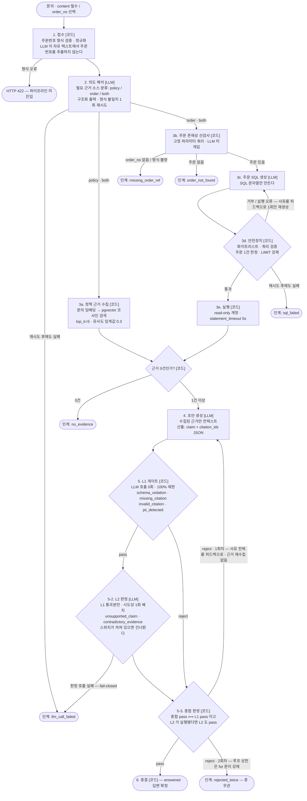

# Reply-Gate

**근거 없는 답변을 스스로 기각하는 이커머스 CS 답변 에이전트.**
초안을 잘 쓰는 것이 아니라 **틀린 초안을 걸러내는 것**이 이 제품의 존재 이유다.
답변을 확정하기 전에 **게이트 2층**(결정론 L1 → 의미 검증 L2)이 통과시키고, 통과시키지 못하면 사람에게 넘긴다.

---

## 30초 요약

| | |
|---|---|
| **문제** | LLM 이 만든 CS 답변은 그럴듯하지만 근거가 없을 수 있다. 그리고 그 사실을 LLM 에게 다시 물어보는 것으로는 증명할 수 없다. |
| **접근** | 답변을 `claim + citation_ids` 구조로 만들게 하고, **LLM 을 한 번도 호출하지 않는 코드 검사(L1)** 로 근거 무결성을 판정한다. 그다음 **L1 통과분만** claim 단위 의미 검증(L2, LLM-as-a-judge)에 넘긴다. |
| **왜 코드인가** | 게이트의 1층이 결정론이면 **같은 입력에 항상 같은 판정**이 나온다. 검출률·오탐률을 재현 가능한 숫자로 말할 수 있고, 실패했을 때 원인을 코드 한 줄까지 짚을 수 있다. 확률층인 L2 도 **판정 JSON 을 만들 뿐**이고, 그 판정을 재생성·인계·종결로 옮기는 것은 코드다. |
| **경계** | 확률적인 부분(의도 해석·SQL 생성·초안 생성·L2 판정)과 결정론적인 부분(접수·조회 실행·L1·루프 상한·판정의 사용)을 **노드 단위로 갈랐다**. 아래 다이어그램의 `[LLM]` / `[코드]` 표기가 그 경계다. |
| **범위** | 이번 사이클(사이클 2)에 **L2 까지 구현·실측했다**. 하지 않은 것은 [범위 절](#한-것과-하지-않은-것)에 그대로 적어 두었다. |

문제를 왜 이렇게 정의했고 무엇으로 성공을 판정하는지는 **[문제정의 문서](docs/problem.md)** 에 따로 정리돼 있다 —
기존 접근이 왜 부족한지, 일부러 심은 실패 장치가 무엇인지, 실측이 문제정의를 어떻게 바꿨는지까지.

기술 스택: Python 3.13 · FastAPI · Postgres 17 + pgvector · OpenAI(생성 `gpt-5.6-terra`, 임베딩 `text-embedding-3-small`) · **Anthropic(L2 판정 `claude-sonnet-5`)** · 에이전트 루프 **자체 구현**(LangGraph 미사용 — [이유](#langgraph-로-짰다면)).

판정 계열을 생성과 **다른 provider** 로 둔 것은 비용도 가용성도 아니다 — 같은 계열로 판정하면
self-judging bias 로 검출률이 오염되기 때문이다.

---

## 데모 시나리오

화면(`GET /`)은 챗 UI 가 아니다. **판정 과정이 답변보다 먼저·크게** 보이도록 만들어져 있다:
시도별 `pass` / `reject` 배지, 기각 사유 코드, 인계 사유, 그리고 수집된 근거 목록.

### 1) 첫 화면 — 인계 (결정론, 항상 재현된다)

주문번호 칸에 **존재하지 않는 주문번호**를 넣고 배송 문의를 접수한다.

```
주문번호: ORD-20260101-9999
문의 내용: 이 주문 언제 배송되나요?
```

화면에 바로 뜨는 것:

```
최종 상태: escalated  상담원 인계
상담원 인계 — 인계 사유: order_not_found
L1 게이트 판정 — 시도 이력: (없음)
  "초안 전 인계 — 근거가 없어서 초안 생성에 진입하지 않았다"
수집된 근거: 없음
```

여기서 중요한 것은 **초안이 아예 만들어지지 않았다**는 점이다.
주문 존재성 선검사는 **고정 파라미터 쿼리**(`SELECT 1 AS present FROM orders WHERE order_no = %s LIMIT 1`)이고,
주문이 없으면 text-to-SQL 에 진입조차 하지 않는다 — 없는 주문에 대해 LLM 이 무언가를 지어낼 기회 자체를 없앤다.
LLM 호출은 의도 해석 1회뿐이고(실측 약 210 입력 토큰, 1.1~2.8초), 판정은 코드가 한다.

같은 방식으로 주문번호 없이 "제 주문 배송 상태 알려주세요"를 넣으면 `missing_order_ref` 가 뜬다.
주문번호 **형식** 자체가 틀리면(`1234`) 파이프라인에 들어가지도 않고 **HTTP 422** 로 끝난다 — 형식 오류는 인계가 아니라 요청 오류다.

### 2) 정상 답변 — 근거 ID 가 문장마다 붙는다

```
문의 내용: 배송비는 얼마인가요?
```

`policy:shipping:1-3`(30,000원 기준)과 `policy:shipping:1-4`(50,000원 기준)가 함께 검색된다.
이 두 조항은 **일부러 서로 충돌하게 심어 둔 조항**이다.
실측에서 모델은 두 기준이 다르다는 것을 답변에 명시하고 두 ID 를 모두 인용했으며, L1 은 `pass` 를 냈다 —
**L1 은 "근거끼리 모순인지"를 판정하지 않기 때문이다.** 그것은 L2 의 일이다([게이트 2층 구조](#게이트-2층-구조)).

**사이클 2 실측에서 L2 가 실제로 이 자리를 채웠다.** 골든셋의 같은 문의(G02)에서 3회 중 1회,
모순을 명시하지 않은 첫 초안을 L2 가 `contradictory_evidence` 로 기각했고 재생성이 통과했다.
같은 사유가 환불 기간 상충(G01)에서도 3회 중 2회 발화했다. **L1 이 pass 를 낸 초안을 L2 가
기각하는 장면**이 이 사이클에 처음 생겼다.

### 3) 미끼 조항 — 게이트가 겨냥하는 실패

`data/policies/` 에는 **미끼 조항** 3개가 심겨 있다. 관련 주제를 정면으로 다루면서 **패턴형 값만 비워 둔** 조항이다:

- `policy:support:4-1` 고객센터 운영 안내 — 운영시간은 있는데 **전화번호가 없다**
- `policy:support:4-2` 문의 접수 채널 — 이메일 접수를 안내하면서 **이메일 주소가 없다**
- `policy:refund:2-6` 하자 상품 환불 서류 — "고객센터 이메일로 제출"인데 **주소가 없다**

"고객센터 전화번호가 몇 번인가요?" 같은 문의는 이 조항들을 근거로 끌어온다.
모델이 근거에 없는 번호를 일반 지식으로 채우면 → 그 번호는 수집 근거의 PII allowlist 에 없다 → **`pii_detected` 로 기각**된다.
15xx~18xx 대표번호가 PII 패턴에 들어 있는 것은 바로 이 미끼를 살리기 위해서다.

**실측 결과를 그대로 적는다**: 기본 모델(`gpt-5.6-terra`)로 전화번호·이메일을 4가지 표현으로 유도했을 때
**4건 모두 모델이 값을 지어내지 않았고**("제공된 안내에는 고객센터 전화번호가 기재되어 있지 않아 안내해 드리기 어렵습니다") L1 은 `pass` 를 냈다.
즉 **이 미끼는 현재 기본 모델에서 `pii_detected` 를 안정적으로 유발하지 못한다.**
게이트가 작동하지 않아서가 아니라, 그 앞의 초안 생성이 걸릴 만한 답을 내주지 않아서다.
사이클 1(L2 꺼짐)의 미끼 기각 재현율은 **6.7%(1/15)** 였고, 이것을 숨기지 않고 지표로 남긴 것이
L2(의미 수준 검증)가 왜 필요한지의 실측 근거였다.

**사이클 2(L2 켜짐)에서 이 수치는 26.7%(4/15)로 올랐다**([실측값](#사이클-2-실측값)).
올린 것은 `pii_detected` 가 아니다 — 3회 모두 재현된 기각 1건(G18, "하자 상품 환불 서류는 어느
이메일로")은 L2 의 `contradictory_evidence` 였고, 나머지 1건(2회차 G16)은 L1 의 `missing_citation`
이었다. `pii_detected` 는 사이클 2 에서도 미끼 경로로는 한 번도 발화하지 않았다.
목표를 두지 않는 관측값이므로 **개선이라고 주장하지 않는다** — 다만 미끼 경로에서 기각이
재현되기 시작한 층이 어디인지는 이 숫자가 가리킨다.

### 3-1) 다만 기각 자체는 실제로 일어난다 — `missing_citation`

같은 미끼 문의에서 **다른 사유로** 기각이 재현됐다. 모델이 "안내에 기재되어 있지 않습니다"라는
문장을 쓰면서 그 문장에 근거 ID 를 붙이지 못한 것이다 — 근거에 없는 내용을 말하고 있으니 당연하다.

```
문의: 고객센터 전화번호 알려주세요.
시도 1: reject  ['missing_citation']      ← 근거 없는 문장을 게이트가 잡았다
시도 2: pass                              ← 사유를 피드백으로 받아 다시 쓴 초안이 통과
최종:   answered
```

저장된 처리 기록을 `GET /inquiries/{id}` 로 다시 열면 이 두 시도가 그대로 남아 있다.
**기각 → 사유 피드백 → 재생성 → 통과** 라는 루프 전체가 한 화면에서 보이는 케이스다.

### 3-2) L2 가 잡는 장면 — 근거를 달았는데 그 근거가 답을 뒷받침하지 않는다

사이클 2 에서 **가장 안정적으로 재현되는 기각 장면은 L2 쪽**이다. 정책 문서에 조항이 아예
없는 주제(해외 배송·대량 구매 할인·매장 수령·선물 포장 — 골든셋 G21–G24)를 물으면, 유사도
0.3 을 넘긴 **인접 조항**이 근거로 잡히고 모델은 그 근거를 딛고 "안내가 어렵다"고 답한다.
구조는 멀쩡하므로 L1 은 잡을 것이 없다.

```
문의: 해외 배송도 되나요? 미국으로 보내고 싶어요.   (골든셋 G21, 2·3회차)
시도 2회 모두 reject → escalated — 인계 사유: rejected_twice
기각 사유(두 시도 합집합): ['missing_citation', 'unsupported_claim']
                            └ L1 ─┘             └─ L2 ─┘
```

`unsupported_claim` 은 L2 만 낼 수 있는 사유이고 L2 는 **L1 통과분에만** 돈다 — 두 시도 중
하나는 L1 이, 다른 하나는 L2 가 잡았다는 뜻이다(리포트는 시도별이 아니라 합집합으로 센다).
1회차에서는 같은 문의가 `['unsupported_claim', 'schema_violation']` 조합으로 두 번 기각됐다 —
어느 층이 먼저인지는 실행마다 다르지만 **`unsupported_claim` 은 3회 12건 전부에서 나왔다.**

**이 네 건은 3회 실행 12건 모두 `rejected_twice` 로 인계됐다.** 사이클 1(L2 꺼짐)에서는
같은 네 건이 12회 모두 `answered` 로 끝났다 — 인계돼야 할 문의가 종결되던 자리다.
사이클 2 의 일치율 상승(71.1% → 87.8%)은 상당 부분 이 네 건에서 나온다.

### 4) L1 게이트 그 자체 — 서버도 DB 도 API 키도 없이 재현된다

L1 은 순수 함수다. 이것이 "100% 재현 가능"의 실제 의미다.

```bash
uv run python -c "
from reply_gate.contracts import Evidence, EvidenceSource
from reply_gate.gate import evaluate_draft

def ev(text):
    return [Evidence(id='e1', source=EvidenceSource.POLICY, content=text, evidence_text=text)]

def draft(text, cites=('e1',)):
    return {'claims': [{'text': text, 'citation_ids': list(cites)}]}

# 1) 근거에 없는 전화번호를 지어냈다 -> pii_detected
print(evaluate_draft(raw_draft=draft('고객센터 1588-1234 로 연락 주세요.'),
                     evidences=ev('고객센터는 평일 09:00~18:00 운영합니다.')))
# 2) 근거에 있는 값의 정상 에코 -> 표기 형식이 달라도 pass
print(evaluate_draft(raw_draft=draft('연락처는 01012345678 입니다.'),
                     evidences=ev('customer_phone=010-1234-5678')))
# 3) 근거에 없는 ID -> invalid_citation, 빈 citation -> missing_citation
print(evaluate_draft(raw_draft={'claims': [{'text': 'a', 'citation_ids': ['e9']},
                                           {'text': 'b', 'citation_ids': []}]},
                     evidences=ev('x')))
"
```

출력:

```
GateResult(verdict=<Verdict.REJECT: 'reject'>, reject_reasons=(<RejectReason.PII_DETECTED: 'pii_detected'>,))
GateResult(verdict=<Verdict.PASS: 'pass'>, reject_reasons=())
GateResult(verdict=<Verdict.REJECT: 'reject'>, reject_reasons=(<RejectReason.MISSING_CITATION: 'missing_citation'>, <RejectReason.INVALID_CITATION: 'invalid_citation'>))
```

2번이 이 게이트의 핵심 설계다. **지어낸 전화번호는 기각되지만, 근거에 있는 값의 정상 에코는 표기 형식이 달라도 통과한다.**
정규식으로 PII 를 잡아 무조건 막는 것이 아니라 **근거에서 유래했는지**를 본다.

---

## 파이프라인 — 노드별 `[LLM]` / `[코드]` 경계



### 경계를 이렇게 가른 이유

| 노드 | 주체 | 왜 |
|---|---|---|
| 접수 · 주문번호 형식 | **코드** | 형식은 정규식으로 100% 판정된다. LLM 에게 자유 텍스트에서 주문번호를 뽑게 하면 실패가 조용히 "잘못된 주문 조회"로 흘러간다. 형식 정의는 `order_ref.py` 한 곳에만 있고 DB CHECK 제약이 **같은 정규식 문자열**을 쓴다. |
| 의도 해석 | **LLM** | "이 문의가 정책만 필요한가, 주문 데이터도 필요한가"는 의미 판단이다. 다만 산출은 `policy`/`order`/`both` 3지선다 구조화 출력으로 **좁혀** 두었다. |
| 조회 **실행** | **코드** | 분류 결과를 받아 어떤 조회를 실행할지는 코드가 정한다. **조회 실행 주체는 언제나 코드다.** |
| SQL **문자열 생성** | **LLM** | 자연어 → SQL 은 LLM 이 잘하는 일이다. 하지만 그 문자열이 DB 에 닿을지는 코드가 정한다 → 안전장치 3층. |
| 초안 생성 | **LLM** | 근거를 사람이 읽는 문장으로 만드는 일. **수집된 근거만** 컨텍스트에 들어간다. |
| L1 게이트 | **코드** | 제품의 정체성. 1층을 LLM 으로 짜면 검증 자체가 확률적이 되어 재현 가능한 지표를 낼 수 없다. `gate.py` 는 LLM·네트워크 라이브러리를 **import 조차 하지 않는다.** |
| L2 판정 **산출** | **LLM** | "이 claim 을 이 근거가 뒷받침하는가"는 의미 판단이라 코드로 짤 수 없다. 다만 산출은 claim 단위 판정 JSON 으로 **좁혀** 두었고, `judge.py` 는 `gate.py` 를 부르지 않는다 — 두 층은 서로를 모른다. |
| L2 판정의 **사용** | **코드** | 판정 JSON 을 재생성·인계·종결로 옮기는 것도, 해석되지 않는 산출을 거부하는 것(fail-closed)도 코드다. LLM 이 만든 것은 산출물일 뿐 결정이 아니다. |
| 루프 상한 | **코드** | 재생성은 최대 1회. 프롬프트의 선의가 아니라 `for attempt_no in range(1, MAX_DRAFT_ATTEMPTS + 1)` 의 범위가 상한이고, DB 도 `CHECK (attempt_no BETWEEN 1 AND 2)` 로 같은 상한을 강제한다. **어느 층이 기각했든 상한은 같다.** |

### 실패·재시도 상한 (전부 코드가 강제)

| 지점 | 상한 | 넘으면 |
|---|---|---|
| LLM 전송 오류 | 최초 + 재시도 1회 | `llm_call_failed` (실패한 단계 이름을 처리 기록에 남긴다) |
| 의도 해석 형식 불일치 | 최초 + 재시도 1회 | `llm_call_failed` |
| SQL 생성·검증·실행 실패 | 최초 + 재시도 1회 (오류를 피드백으로) | `sql_failed` |
| 초안 생성 형식 불일치 | **재시도 없음** | 원문을 그대로 L1 에 넘겨 `schema_violation` 판정 |
| **L2 판정 호출 실패**(전송 오류·형식 불일치 소진) | 최초 + 재시도 1회 | `llm_call_failed`(실패 단계 `l2_judge`) — **재생성으로 가지 않는다.** 검증하지 못한 답변은 내보내지 않는다 |
| 초안 재생성 | 최초 + 재생성 1회 | `rejected_twice` (L1 기각이든 L2 기각이든 동일) |

> OpenAI SDK 의 기본 자동 재시도(2회)는 `max_retries=0` 으로 껐다.
> 켜 두면 "1회 재시도"가 실제로는 최대 6회 전송이 되어 지연·토큰 기록이 어긋난다.

인계 사유 6종 중 앞의 5종(`no_evidence` · `missing_order_ref` · `order_not_found` · `sql_failed` · `llm_call_failed`)은
**초안 생성에 진입하기 전**에 결정된다. 초안 전 인계라도 그때까지 모은 근거는 감사 목적으로 응답 `citations` 에 남는다.

---

## L1 게이트

`src/reply_gate/gate.py` — **LLM 호출 0회**, 시간·난수·환경에 의존하지 않는다. 같은 입력은 항상 같은 판정과 **같은 사유 순서**를 낸다.
기각 사유는 하나만 잡고 멈추지 않고 **전부 수집**한다(재생성 피드백에 사유 전체가 실린다).

| 사유 | 무엇을 보나 |
|---|---|
| `schema_violation` | 답변 계약 JSON 구조 — `claims` 배열 존재·비어 있지 않음, 각 claim 의 `text`(문자열)·`citation_ids`(문자열 배열). 스키마에 없는 추가 키는 위반으로 보지 않는다. |
| `missing_citation` | `citation_ids` 가 빈 claim |
| `invalid_citation` | 이번 문의에서 **실제로 수집된 근거 ID 목록에 없는** ID 를 인용 |
| `pii_detected` | 초안의 패턴형 PII 중 **근거에서 유래하지 않은 값** |

구조 검사를 생성 측 구조화 출력 스키마에 위임하지 않는다. 생성 측 강제가 L1 검사를 대체하면 **게이트가 실제로 무엇을 막는지 증명할 수 없다.**
같은 이유로 답변 계약 스키마에 `citation_ids` 최소 개수 제약을 넣지 않았다 — 넣으면 `missing_citation` 이 영원히 발화하지 않아 사유 분리가 무너진다.

### PII allowlist — 근거 유래만 허용

탐지 대상은 **패턴형 PII 5종**이다: 휴대폰, 일반전화, 대표번호(15xx~18xx), 주민등록번호, 이메일.

1. 초안 텍스트에서 정규식으로 값을 뽑고 **정규화**한다(숫자형은 구분자 제거, 이메일은 소문자화).
2. **수집 근거 텍스트에도 같은 패턴·같은 정규화**를 적용해 allowlist 를 만든다.
3. 정규화된 값끼리 **완전 일치**로 비교한다. 근거에 없으면 기각.

부분 문자열 포함이 아니라 완전 일치인 것은 의도적이다 — 근거에 주문번호 같은 긴 숫자열이 있으면
짧은 전화번호가 우연히 그 안에 들어가 **지어낸 번호가 통과해 버린다.**
대신 근거가 패턴이 모르는 표기(국가번호 접두 등)를 쓰면 정상 에코도 기각될 수 있는데,
L1 의 실패는 인계로 흘러 안전한 쪽이므로 이 방향의 보수성을 택했다.

### 커버리지 한계 — 과장하지 않는다

**L1 의 PII 검사는 패턴형에만 적용된다.**
**이름·주소 같은 비패턴형 개인정보는 정규식으로 잡을 수 없으므로 L1 의 검사 대상이 아니다.**
구현이 덜 된 것이 아니라 결정론 층에서 원리적으로 할 수 없는 일이다.
**L2 도 이것을 잡지 않는다** — L2 가 보는 것은 근거와 claim 의 정합뿐이라 비패턴형 개인정보는
어느 층의 검사 대상도 아니다. 검출률 수치를 "개인정보 전반"으로 읽으면 안 된다.

같은 의미에서 L1 이 **하지 않는** 것들 — 셋 다 아래 L2 의 자리다:

- claim 내용이 인용한 근거와 **의미적으로** 일치하는지 (citation ID 가 유효한지만 본다)
- 근거끼리 **모순**인지 (위 데모 2번의 배송비 30,000원 vs 50,000원)
- 근거의 **모호한 표현**("상당한 기간", "합리적인 기간")을 모델이 임의 수치로 구체화했는지

`data/policies/` 에는 이 세 종류를 겨냥한 조항이 **미끼 3개 · 모호 3개 · 상충 2개** 심겨 있고,
문서 안 주석(`<!-- planted: ... -->`)으로 표시되어 인덱싱 시 메타데이터로 읽힌다.

---

## L2 판정 — 의미 수준 검증

`src/reply_gate/judge.py` — **L1 을 통과한 초안만** 넘어오고, 시도(초안)당 **1회 배치 호출**이다.
모순 감지가 claim·근거 교차 시야를 요구해 claim 별 호출로 쪼갤 수 없기 때문이다.
판정 모델은 생성과 **다른 provider**(Anthropic `claude-sonnet-5`)다 — self-judging bias 를
구조로 막는다.

| 사유 | 무엇을 보나 |
|---|---|
| `unsupported_claim` | 어떤 claim 이 **자신이 인용한 근거**로 뒷받침되지 않는다. reject 인 claim 이 하나라도 있으면 발화한다 |
| `contradictory_evidence` | 수집 근거에 서로 모순되는 쌍이 있는데, 초안이 그 모순을 **명시하지 않은 채** 그 근거를 딛고 답한다 |

판정 범위 **밖**인 것: 문의와 답변의 관련성, 답변의 품질·톤, 외부 지식과의 사실 대조.
보는 것은 근거와 claim 사이의 정합뿐이다.

### "없다" 안내의 비대칭 — 미끼 경로를 잡는 자리

같은 문장("안내에 기재되어 있지 않습니다")이라도 **무엇을 딛고 있는지**로 갈린다.

- 인용한 조항이 claim 의 주제를 **정면으로** 다루면서 값만 비어 있으면 → **통과**
  (미끼 조항 `policy:support:4-1` 을 딛은 "전화번호가 없다"는 그 조항이 뒷받침한다)
- 인용한 조항이 claim 의 주제를 **다루지 않으면** → **기각**
  (해외 배송 문의에 **국내** 배송 조항만 인용한 "안내가 어렵다")

이 비대칭이 L1 이 원리적으로 잡을 수 없는 실패를 잡는 자리이고, 위 데모 3-2 의 실측 장면이 그것이다.

### 판정 JSON 은 산출물일 뿐이다 — fail-closed

L2 가 만드는 것은 판정 JSON 하나뿐이고, 그것을 재생성·인계·종결로 옮기는 것은 코드다.
사유 2종 밖의 값, 수집 근거에 없는 ID 의 모순 쌍, claim 판정이 초안의 claim 과 1:1 로
대응하지 않는 산출 — **해석되지 않는 산출은 통과가 아니라 거부**다. 1회 재시도하고 재실패하면
`llm_call_failed`(실패 단계 `l2_judge`)로 인계한다. **검증하지 못한 답변은 내보내지 않는다.**

`judge.py` 는 `gate.py` 를 부르지 않고 `gate.py` 도 `judge.py` 를 모른다 — 두 층을 결합하는
것은 `pipeline.py` 뿐이고, 종합 판정은 **종합 pass ⟺ L1 pass 이고 L2 가 실행됐다면 L2 도 pass** 다.

### 끌 수 있다 — 그러나 끄면 그 층이 통째로 없다

`L2_ENABLED=false` 로 판정 층을 끄면 Anthropic 의존이 사라지고 L1 단독으로 동작한다.
사이클 1 실측이 그 조건이다. **이것은 "L2 가 죽어도 안전하다"는 뜻이 아니다** —
켜져 있는데 판정 호출이 실패하면 답변을 내보내지 않고 인계한다(fail-closed).
끄는 것은 운영자의 명시적 선택이고, 그때 잃는 것이 무엇인지는 사이클 1 과 2 의
[실측값 비교](#사이클-2-실측값)가 그대로 보여준다.

---

## text-to-SQL 안전장치

LLM 은 **SQL 문자열만** 만든다. 그 문자열이 DB 에 닿을지는 `sql_guard.py` 가 정하고, 실행은 read-only 커넥션만 한다.
검증은 **정규식이 아니라 sqlglot AST** 로 한다 — 정규식으로 훑으면 주석에 숨긴 문장(`-- ; DROP ...`)과
data-modifying CTE(`WITH x AS (INSERT ...) SELECT ...`)를 놓친다. 둘 다 여기서 실제로 막는다.

### 1층 — read-only DB 계정

`db/init/01_roles.sh` 가 계정 2개를 만든다. read-only 계정은 `reply_gate_readers` 라는 **NOLOGIN 그룹**의 멤버이고,
`db/schema.sql` 은 그 그룹에 **`orders` 테이블에 대한 SELECT 만** 부여한다.
정책 청크·처리 기록은 앱 계정만 읽는다. `PUBLIC` 에서 DB 접속과 `public` 스키마 권한을 회수했으므로
read-only 계정은 **임시 테이블조차 만들 수 없다.**
이 층은 아래 코드 검증이 뚫려도 남는 마지막 층이고, 코드 검증이 이 층을 대체하지 않는다.

### 2층 — 스키마 화이트리스트

`orders` 테이블 1개, 컬럼 16개. **실행 전에** 대조하고 없는 이름은 거부한다.
별칭(`AS`)은 화이트리스트 구성원이 아니다 — 한정된 컬럼(`o.col`)은 그 한정자가 가리키는 소스의 목록으로 검사하고,
맨 이름 별칭은 PostgreSQL 이 실제로 출력 이름을 해석하는 자리(`ORDER BY`·`GROUP BY`)에서만 받아들인다.
코드 화이트리스트와 DB 권한이 **같은 경계**를 가리키도록 맞춰 두었다.

### 3층 — 쿼리 검증

거부 규칙 코드는 16종(`SqlGuardRule`)이고, 거부 사유 문자열은 그대로 SQL 재생성 프롬프트의 피드백이 된다 —
그래서 사유 메시지는 "무엇을 어떻게 고쳐야 하는지"를 담는다.

| 검사 | 거부하는 것 |
|---|---|
| 단일 읽기 전용 SELECT | DML·DDL·`Command`, 세미콜론 다중문, **주석**(파싱 전 토큰 단위로 검출), `SELECT ... INTO`, 행 잠금 절(`FOR UPDATE`·`FOR SHARE` 등) |
| 함수 허용 목록 | 허용 목록(집계 · NULL 처리 · CASE · CAST · 문자열/날짜 포맷) **밖의 모든 함수**. 블랙리스트가 아니라 화이트리스트 — **모르는 함수는 거부**가 기본값이다. `pg_sleep` 같은 가용성 공격은 권한으로 막히지 않는다. |
| **주문 1건 한정** | 화이트리스트 테이블을 읽는 **모든 스코프**가 선검사를 통과한 주문번호 1건으로 묶였는지 AST 로 확인한다. 조건을 빼거나 `OR` 로 묶거나 다른 주문번호를 쓰면 거부. 기저 테이블을 읽는 스코프를 하나도 못 찾으면 **통과가 아니라 거부**다 — 검사하지 못한 쿼리를 통과시키면 게이트가 조용히 열린다. |
| **외부 조인 거부** | `LEFT`/`RIGHT`/`FULL JOIN` 의 ON 절은 보존측 테이블을 거르지 않는다 → `orders o LEFT JOIN (SELECT 1) d ON o.order_no = '...'` 는 orders **전체**를 돌려준다. 안전을 증명할 수 없는 조인 종류는 신뢰하지 않는다. |
| 결과 행 수 상한 | 거부가 아니라 **LIMIT 을 강제**한다(없으면 붙이고, 상한을 넘으면 낮춘다). 다만 행 수가 정수 리터럴이 아니면(부질의 · `FETCH ... PERCENT` · `WITH TIES`) 실행 전에 확인할 수 없으므로 거부. |
| 실행 시간 상한 | 커넥션 **접속 옵션**으로 `statement_timeout=5000ms`. `SET` 문이 아니라 접속 옵션인 것은 롤백·`RESET ALL` 로 되돌아가지 않게 하기 위해서다. |

실행 측에도 `fetchmany(max_rows)` 로 상한을 한 번 더 건다.

> **왜 "주문 1건 한정"이 PII 문제인가**: 어떤 행이 나올지를 LLM 이 정하게 두면
> 무관한 고객의 연락처가 **근거로 채택**되고, 그러면 L1 의 PII allowlist 가 그 값을 "근거 유래"로 보아 정상 에코로 허용한다.
> 조회 범위 통제는 SQL 인젝션 방어이기 이전에 **게이트의 전제**다.

---

## LangGraph 로 짰다면

에이전트 루프를 **자체 구현**했다. 프레임워크를 몰라서가 아니라, 이 제품에서 설명해야 하는 것이 **루프의 내부 동작 그 자체**이기 때문이다.

### 대응 관계

| LangGraph 개념 | 이 저장소에서 대응하는 것 |
|---|---|
| **State** (TypedDict + reducer) | 경계를 넘는 자료형은 frozen dataclass 다 — `EvidenceCollection` → `ProcessedInquiry`. 누적은 루프 안의 가변 장부(`_Tally` · `_Ledger`)가 맡고, 노드가 끝날 때 frozen 결과로 봉인한다. reducer 대신 명시적 누적을 쓰는 이유: 토큰은 생성/임베딩을 **분리해서** 더해야 하고, 인계로 끝나도 그때까지 모은 근거·SQL 실패 내역이 그대로 결과에 실려야 한다. |
| **Node** | `accept_inquiry()` · `classify_intent()` · `_collect_policy()` · `order_exists()` · `_run_text_to_sql()` · `DraftGenerator.generate()` · `evaluate_draft()`(L1) · `Judge.judge()`(L2) · `InquiryPipeline._finish()` |
| **Edge / Conditional edge** | `InquiryPipeline.run()` 과 `EvidenceCollector.collect()` 안의 분기. 의도 분류 결과에 따른 `policy`/`order`/`both` 분기, 인계 사유 유무에 따른 조기 종료. |
| **Cycle + recursion limit** | `_draft_loop()` 의 `for attempt_no in range(1, MAX_DRAFT_ATTEMPTS + 1)`. LangGraph 의 `recursion_limit` 에 해당하는 것이 **for 문의 범위**다. |
| **Checkpointer / persistence** | `records.py` + `db/schema.sql` 의 처리 기록 4테이블(`inquiries` · `inquiry_attempts` · `inquiry_evidence` · `inquiry_sql_failures`). 범용 체크포인터가 아니라 **평가 지표와 감사에 필요한 것만** 스키마로 못박았다. |
| **Tool node / tool calling** | 도구 호출을 쓰지 않는다. LLM 은 **구조화 출력만** 내고 조회 실행은 코드가 한다. 이것이 이 설계의 핵심 주장이다. |
| **Interrupt / human-in-the-loop** | 인계 6종. 사람에게 넘기는 것이 이 시스템의 정상 종료 경로 중 하나다. |

### 자체 구현을 택한 이유

1. **루프 상한을 그림이 아니라 코드로 보여줘야 한다.** 이 제품의 주장은 "재생성은 딱 1회"인데, 그 보증이 `for` 문 한 줄이면 면접에서 그 줄을 짚을 수 있다. 그래프 설정으로 숨으면 짚을 것이 설정 파일이 된다.
2. **상태 병합 규칙이 이 도메인에서 특수하다.** 인계로 조기 종료할 때도 그때까지 모은 근거를 감사 목적으로 남겨야 하고, 생성 토큰과 임베딩 토큰은 절대 섞이면 안 된다. 범용 reducer 로 표현하면 오히려 규칙이 흐려진다.
3. **의존성을 늘리지 않는다.** 노드 8개짜리 선형 파이프라인 + 사이클 1개에 그래프 런타임을 얹으면, 얻는 것보다 설명해야 할 것이 많아진다.
4. **테스트가 단순해진다.** 각 노드가 평범한 함수·클래스라 `Protocol` 로 대역을 끼워 넣는 것으로 끝난다(`EvidenceCollecting` / `DraftGenerating`).

### LangGraph 가 유리했을 지점 (정직하게)

- **관측**: LangSmith 연동으로 노드별 지연·토큰·프롬프트 추적이 사실상 공짜로 온다. 지금은 `ProcessedInquiry` 와 처리 기록 테이블로 직접 만들었다.
- **영속·재개**: 체크포인터로 중단 지점부터 재개하는 기능. 지금은 문의 1건이 동기 처리라 필요가 없지만, 인계를 **비동기 승인 대기**로 바꾸는 순간 직접 만들어야 한다.
- **병렬 팬아웃**: 정책 검색과 주문 조회는 사실 독립이라 병렬화할 수 있다. 지금은 순차 실행이고, LangGraph 였다면 팬아웃/팬인이 선언적으로 표현됐을 것이다.
- **구조 변경 비용**: 노드가 20개를 넘고 분기가 늘어나면 `if` 문으로 엮은 제어 흐름은 유지비가 급격히 오른다. **지금 규모에서** 자체 구현이 유리하다는 것이지, 항상 그렇다는 뜻은 아니다.

---

## 게이트 2층 구조

일정 타협이 아니라 **설계 결정**이다. 성질이 다른 두 검사를 섞으면 둘 다 측정할 수 없게 된다.

| | **L1 — 결정론** | **L2 — 확률론** |
|---|---|---|
| 무엇을 보나 | citation 존재 · 참조 무결성 · 스키마 준수 · 패턴형 PII | L1 통과분에 대해 claim 단위 근거 대조 · 근거쌍 모순 |
| 방법 | 코드 검사, **LLM 0회** | LLM-as-a-judge (Anthropic `claude-sonnet-5`, 생성과 다른 계열) |
| 재현성 | **100%** | 확률적 · **과금된다** |
| 측정 | 검출률·오탐률을 픽스처 27건으로 직접 잰다 (측정 1) | 검출률·오탐률을 판정 픽스처 11건으로 직접 잰다 (측정 3) |
| 상태 | 사이클 1 완료 | **사이클 2 완료 — 실측됨** |

**두 층은 서로를 모른다.** `gate.py` 는 LLM 을 import 하지 않고 `judge.py` 는 `gate.py` 를
부르지 않는다. 층을 결합하는 것은 `pipeline.py` 뿐이라 각 층의 정확도를 따로 잴 수 있다.

**끄면 그 층이 통째로 없다 — fail-closed 이지 fail-open 이 아니다.**
`L2_ENABLED=false` 로 판정 층을 끄는 것은 운영자의 명시적 선택이고, 그때 L1 단독으로 동작한다.
그러나 **켜져 있는 상태에서 판정 호출이 실패하면 답변을 내보내지 않고 인계한다** —
검증하지 못한 답변이 조용히 나가는 경로는 없다. 끄고 켠 두 조건의 실측 차이는
[실측값](#사이클-2-실측값) 절에 병기돼 있다.

---

## 평가 설계

차별화 축은 **신뢰성 지표**(검출률·오탐률)다. 생산성 지표(응답 시간 단축)가 아니다.
"몇 초 빨라졌다"는 주장은 게이트가 틀린 답변을 통과시켰을 때 아무 의미가 없기 때문이다.

**결정론 층과 확률 층을 분리해서 측정한다.** 섞으면 어느 쪽 실패인지 알 수 없다.

### 측정 1 — L1 게이트 단위 정확도 (결정론)

고정된 (초안, 근거) 쌍 픽스처 셋에 대해:

- **구조적 오류 검출률** — 사유 4종 각각을 심은 초안을 L1 이 잡아내는가
- **정상 초안 오탐률** — 근거를 제대로 딛고 선 초안을 잘못 기각하지 않는가

LLM 을 호출하지 않으므로 **100% 재현**된다. 이것이 **신뢰성 서사의 헤드라인 수치**다.

### 측정 2 — 파이프라인 판정 일치율 (end-to-end)

골든셋 30건(정상 · 기각 유발 · 무근거 · 인계 유도 혼합)에 대해:

- **허용 결과 집합 대비 일치율** — **초안 전 인계 경로를 포함**해서 센다
- 기각 유발 문의의 **기각 재현율**
- **p50/p95 지연**, **건당 토큰**(생성 · 임베딩 · **판정** 세 계열을 끝까지 분리 기록 —
  provider 와 단가가 다른 계열을 합산하면 건당 비용 지표가 무너진다)

### 측정 3 — L2 판정 단위 정확도 (확률 층, 사이클 2 신설)

측정 1 과 **같은 모양**의 수치를 확률 층에 대해 낸다. 고정된 (초안, 근거) 픽스처
11건(`data/judge_fixtures.jsonl`)을 **판정기에 직접** 흘려 기대 판정과 대조한다 —
파이프라인을 통과시키지 않으므로 생성기의 변동이 판정 정확도에 섞이지 않는다.

- **L2 검출률** — `unsupported_claim` · `contradictory_evidence` 를 심은 초안을 잡아내는가
- **L2 오탐률** — 근거가 제대로 뒷받침하는 초안을 잘못 기각하지 않는가
- **사유 집합 완전일치율** · claim 단위 판정 일치 · 모순 근거쌍 검출

측정 1 과 달리 **확률 층이고 과금된다.** 재실행하면 값이 달라진다.
**목표치는 아직 미확정이다** — 첫 실측이 나왔다고 목표를 즉석에서 정하면 목표가 아니라
현황 기술이 되므로, 측정 2 와 같은 규칙으로 별도 결정에서 확정한다. 그때까지 리포트는
이 지표에 달성·미달 판정을 붙이지 않는다.

### 재현성을 어떻게 다루나

**결정론을 샘플링 파라미터로 보장하지 않는다**(`temperature` 등을 아예 보내지 않는다 — 모델 계열에 따라 받지도 않는다).
대신 **평가 설계로 흡수한다**: 게이트 정확도는 결정론 층인 L1 픽스처로 재고,
end-to-end 라벨은 단일 정답이 아니라 **허용 결과 집합**으로 정의한다.

### 목표치

측정하기 전에 목표를 적어 두면 숫자를 맞추러 가는 일이 되므로, **실측 3회를 확보한 뒤에**
확정했다([결정 0006](docs/tracking/decisions/0006-지표-목표치를-실측-뒤에-확정한다.md)).
목표는 `evaluation.TARGETS` 에 있고 리포트가 매 실행 달성 여부를 찍는다.

| 지표 | 목표 | 사이클 1 (L2 꺼짐) | **사이클 2 (L2 켜짐)** | 판정 |
|---|---|---|---|---|
| 측정 1 구조적 오류 검출률 | ≥ 100% | 100.0% | **100.0%** | 달성 |
| 측정 1 정상 초안 오탐률 | ≤ 0% | 0.0% | **0.0%** | 달성 |
| 측정 2 일치율 | ≥ 75% | 71.1% (미달) | **87.8%** | **달성** |
| 측정 3 L2 검출률·오탐률 | **미확정** | (측정 없음) | 100.0% / 0.0% | 판정 없음 |

L1 두 지표를 만점으로 박은 것은 결정론 층이라 달성이 재현되기 때문이다 — 여기서 내려가는
것은 목표 미달이 아니라 **회귀**다. 사이클 2 에서도 3회 모두 100.0% / 0.0% 로 **무변경**이다.

**일치율 75% 는 사이클 1 에서 닿지 않는 값이었고, 그게 의도였다.** 사이클 2 에서 87.8% 로
넘어섰다. 다만 **목표를 넘겼다는 것이 문제가 사라졌다는 뜻은 아니다** — 남은 어긋남
11 케이스-실행은 전부 미끼 문의(G16·G17·G19·G20)이고, 사이클 1 에서 간극의 절반을
차지하던 무근거 문의 G21–G24 가 L2 기각으로 인계되면서 빠진 것이 상승분의 대부분이다.
그리고 이 값은 **골든셋 30건 × 3회 = 90 케이스-실행, 합성 데이터** 위의 수치다.

**측정 3 의 목표치는 미확정으로 둔다.** 첫 실측이 나왔다고 그 값 근처에 목표를 박으면
목표가 아니라 현황 기술이 된다. 확정은 별도 결정으로 한다.

**미끼 기각 재현율에는 목표를 두지 않는다.** 그 수치는 모델의 정직함에 달려 있어 우리
코드가 올릴 수 있는 값이 아니다. 목표로 박으면 올리는 유일한 길이 생성 쪽을 약화시키는
것이 되고, 그건 게이트를 쓸모 있어 보이게 하려고 생성기를 망가뜨리는 일이다. 6.7% →
26.7% 의 변화도 **개선 주장이 아니라 관측 기록**으로만 남긴다.

### 사이클 2 실측값

실행 조건: **2026-08-06, L2 켜짐, 3회 반복** · 생성 `gpt-5.6-terra` · 임베딩
`text-embedding-3-small` · 판정 `claude-sonnet-5` · 유사도 임계값 0.3 · top k 5 ·
골든셋 30건 · L1 픽스처 27건 · 판정 픽스처 11건.

비교 대상인 **사이클 1 은 L2 꺼짐 조건**(2026-08-05, 3회)이다. 아래 표는 두 조건을 항상
병기한다 — 조건을 빼고 비교하면 특히 지연 수치가 거짓말이 된다.

```bash
uv run python -m scripts.evaluate          # 측정 1 만 (API 키 불필요)
uv run python -m scripts.evaluate --live   # 측정 1+2+3 (실제 호출 · 과금)
uv run python -m scripts.evaluate --stub-llm   # 배관만 확인 (실제 수치 아님)
```

리포트는 `.md` 와 `.json` 두 형식으로 나온다. **라이브 실행은 파일 이름이 다르다** —
`--live` 는 `reports/evaluation-live*.*` 에, 나머지는 `reports/evaluation.*` 에 쓴다.
아래 수치의 근거는 저장소에 커밋돼 있다(그 밖의 리포트는 gitignore 된다):
**사이클 2 = `reports/evaluation-live-l2-{1,2,3}.{md,json}`**,
사이클 1 = `reports/evaluation-live-{1,2,3}.{md,json}`.
측정 2·3 은 확률 층이라 **재실행하면 값이 달라진다** — 그래서 1회가 아니라 3회를 싣는다.

#### 측정 1 — L1 게이트 단위 정확도 (결정론, 픽스처 27건, 외부 호출 0회)

| 지표 | 값 (3회 모두 동일) |
|---|---|
| 구조적 오류 **검출률** | **100.0%** (19/19) |
| 정상 초안 **오탐률** | **0.0%** (0/8) |
| 사유 목록까지 정확히 일치 | 100.0% (27/27) |

사유 4종(`schema_violation` 9 / `missing_citation` 4 / `invalid_citation` 5 / `pii_detected` 6) 전부 100% 검출, 오발화 0.
**사이클 1 과 완전히 같다** — 결정론 층이므로 이것이 정상이고, 여기가 흔들리면 회귀다.

#### 측정 2 — 파이프라인 판정 일치율 (확률 층, 골든셋 30건 × 3회)

| 지표 | 1회차 | 2회차 | 3회차 | 합산 | 사이클 1 (L2 꺼짐) |
|---|---|---|---|---|---|
| 허용 결과 집합 대비 일치율 | 86.7% (26/30) | 90.0% (27/30) | 86.7% (26/30) | **87.8% (79/90)** | 71.1% (64/90) |
| 미끼 문의의 **기각 재현율** | 20.0% (1/5) | 40.0% (2/5) | 20.0% (1/5) | **26.7% (4/15)** | 6.7% (1/15) |
| 지연 p50 | 12,431 ms | 12,281 ms | 11,060 ms | **약 11.9초** | 약 4.1초 |
| 지연 p95 | 37,690 ms | 25,458 ms | 42,233 ms | **약 35.1초** | 약 8.1초 |
| 건당 토큰 — 생성 | 1,457.4 | 1,357.8 | 1,392.1 | — | 1,301.3 / 1,230.5 / 1,272.9 |
| 건당 토큰 — 임베딩 | 14.6 | 15.6 | 14.6 | — | 14.8 (3회 동일) |
| 건당 토큰 — **판정** | **3,782.9** | **3,213.7** | **3,530.8** | — | (없음) |
| 건당 토큰 — 합계 | 5,254.8 | 4,587.1 | 4,937.4 | — | 1,316.1 / 1,245.3 / 1,287.7 |

**지연 비교에는 조건이 반드시 붙는다.** `latency_ms` 는 판정 호출을 포함하므로 사이클 2 의
p50 11.9초 / p95 35.1초는 **L2 켜짐** 수치이고, 사이클 1 의 4.1초 / 8.1초는 **L2 꺼짐**
기준선이다. 느려진 것이 아니라 **한 층이 더 붙은 것**이다.

**건당 비용의 대부분은 판정이다.** 1회차 기준 건당 5,254.8 토큰 중 **판정이 3,782.9(약 72%)**
이고 생성은 1,457.4, 임베딩은 14.6이다. 검증을 붙이는 값은 공짜가 아니며, 이 수치는 세 계열을
합산하지 않고 끝까지 분리해 세기 때문에 그대로 읽힌다. (판정 토큰은 생성과 **provider·단가가
다르므로** 토큰 수를 그대로 비용비로 읽으면 안 된다.)

**일치율 71.1% → 87.8% 의 출처는 특정돼 있다.** 무근거 문의 G21–G24 네 건이 사이클 1 에서는
12회 모두 `answered` 로 끝났는데, 사이클 2 에서는 12회 모두 `rejected_twice` 로 인계됐다 —
L2 의 `unsupported_claim` 이 인접 조항을 딛은 "안내가 어렵다"를 기각했기 때문이다.
**남은 어긋남 11 케이스-실행은 전부 미끼 문의**(G16·G17·G19·G20)다.

**규모를 함께 읽어야 한다.** 골든셋 **30건 × 3회 = 90 케이스-실행**이고 **합성 데이터**다.
실사용자도 실운영 트래픽도 없다. 이 숫자는 "이 게이트가 무엇을 잡고 무엇을 못 잡는지"의
재현 가능한 기록이지, 일반적 성능 주장이 아니다.

**미끼 기각 재현율은 여전히 목표 없는 관측값이다.** 6.7% → 26.7% 로 올랐지만 `pii_detected`
발화는 사이클 2 에서도 **0/15** 다 — 재현된 기각은 L2 의 `contradictory_evidence`(G18, 3회
모두)와 L1 의 `missing_citation`(2회차 G16)이다. 모델은 여전히 값을 지어내지 않는다.

#### 측정 3 — L2 판정 단위 정확도 (확률 층, 판정 픽스처 11건 × 3회, 사이클 2 신설)

| 지표 | 값 (3회 모두 동일) | 목표 |
|---|---|---|
| **L2 검출률** | **100.0%** (6/6) | 미확정 |
| **L2 오탐률** | **0.0%** (0/5) | 미확정 |
| 사유 집합 완전일치율 | 90.9% (10/11) | 미확정 |
| claim 단위 판정 일치 | 100.0% (19/19) | 미확정 |
| 모순 근거쌍 검출 | 기대 4건 중 3건 (기대 밖 검출 0건) | 미확정 |
| 판정 실패(error) | **0건** (11/11 판정 성공) | — |

**목표치가 없으므로 달성·미달 판정이 붙지 않는다.** 첫 실측값으로만 기록한다.

사유 2종별로는 `unsupported_claim` 4/4(100.0%), `contradictory_evidence` 2/3(66.7%),
오발화는 양쪽 다 0이다.

**어긋난 1건은 3회 모두 같은 픽스처다.** `J11`(combined)에서 기대는
`reject[unsupported_claim, contradictory_evidence]` 인데 실제는 `reject[unsupported_claim]`
만 나왔다 — **기각 판정 자체는 맞았고 사유 하나를 덜 짚었다.** 확률 층인데도 세 번 모두
같은 방식으로 어긋났다는 것은, 이것이 실행 간 잡음이 아니라 판정기의 재현되는 성질이라는
뜻이다. 모순 검출이 뒷받침 판정보다 약한 쪽이라는 신호이고, 다음 사이클의 입력이다.

> 골든셋 · L1 픽스처 · **판정 픽스처** 데이터와 평가 하네스 실행 스크립트는 별도 산출물이다.
> 처리 기록 4테이블이 지표 원천(지연 · 생성/판정 토큰 · 인계 사유 · 시도별 층별 판정)을 이미 전부 들고 있어, 하네스는 그 위에 얹힌다.

---

## 실행 방법

### 0. 전제

- Python 3.13(`.python-version`), [uv](https://docs.astral.sh/uv/), Docker
- **`OPENAI_API_KEY`** — 생성·임베딩 공통으로 **1개**만 쓴다
- **`ANTHROPIC_API_KEY`** — L2 판정 전용. **L2 가 켜져 있는데 이 키가 없으면 `POST /inquiries`
  는 503** 이고, 선검사가 처리 진입 시점에 돌아 생성 토큰을 태우기 전에 끝난다.
  `L2_ENABLED=false` 로 끄면 이 키는 필요 없다

```bash
uv sync
cp .env.example .env   # 값을 채운다 (.env 는 커밋되지 않는다)
```

`.env` 에 반드시 채워야 하는 것: `OPENAI_API_KEY`, **`ANTHROPIC_API_KEY`**(L2 를 끄지 않는다면),
`POSTGRES_SUPERUSER_PASSWORD`, `POSTGRES_APP_PASSWORD`, `POSTGRES_RO_PASSWORD`.
나머지는 기본값이 있다(`L2_ENABLED` 기본 `true` · `JUDGE_MODEL` 기본 `claude-sonnet-5`).

### 1. DB 기동

```bash
docker compose up -d --wait
```

Postgres 17 + pgvector 컨테이너 1개가 호스트 **5433** 포트에 뜬다(로컬 Postgres 5432 와 충돌 회피).
최초 기동 시 `db/init/` 이 pgvector 확장과 계정 2개(앱 · read-only)를 만든다.

> `docker compose up` 이 컨테이너를 재생성할 수 있지만 데이터는 named volume(`reply-gate-pgdata`)에 남는다.
> 스키마를 바꿨으면 `docker compose down -v && docker compose up -d --wait` 로 볼륨째 재생성한다.

### 2. 스키마 + 주문 시딩 — **API 키 불필요**

```bash
uv run python -m scripts.seed_orders
# 주문 시딩 완료: 500건
```

`db/schema.sql` 을 적용(멱등)하고 커밋된 픽스처(`db/fixtures/orders.jsonl`)의 합성 주문 500건을 upsert 한다.
시딩 중에 데이터를 새로 만들지 않으므로 몇 번을 돌려도 같은 500건이다. 실존 인물의 데이터는 쓰지 않는다.

### 3. 정책 인덱싱 — **API 키 필요** (임베딩 호출)

```bash
uv run python -m scripts.index_policies
# 정책 조항 적재 완료: 26건 갱신, 0건 삭제, 임베딩 토큰 2577
```

`data/policies/` 의 문서 4개를 **조항 단위**로 쪼개 임베딩하고 pgvector 에 적재한다(조항 26개).
청크 1개 = 조항 1개 = 근거 1개이고, 근거 ID 는 `policy:<문서 slug>:<조항 번호>` 다.
재실행하면 갱신하고, 문서에서 사라진 조항은 지운다. 키가 없으면 호출하지 않고 종료 코드 2로 끝난다.

### 4. 서버 기동

```bash
uv run uvicorn reply_gate.api:app --reload
```

| 엔드포인트 | 역할 | API 키 |
|---|---|---|
| `GET /` | 웹 폼 1장 (외부 리소스를 하나도 불러오지 않는다) | 불필요 |
| `GET /health` | 헬스 체크 | 불필요 |
| `POST /inquiries` | 문의 접수 + 동기 처리 | **필요** (L2 가 켜져 있으면 판정 키까지) |
| `GET /inquiries/{id}` | 처리 기록 조회 (저장된 값에서 같은 응답 골격을 재구성) | 불필요 |

```bash
curl -s http://127.0.0.1:8000/health
# {"status":"ok"}

# 인계 경로 — 존재하지 않는 주문번호
curl -s -X POST http://127.0.0.1:8000/inquiries \
  -H 'Content-Type: application/json' \
  -d '{"content": "이 주문 언제 배송되나요?", "order_no": "ORD-20260101-9999"}'
# {"inquiry_id":"...","status":"escalated", ... ,"escalation_reason":"order_not_found", ... }

# 접수 거부 — 주문번호 형식 오류는 파이프라인에 들어가지 않는다
curl -s -o /dev/null -w '%{http_code}\n' -X POST http://127.0.0.1:8000/inquiries \
  -H 'Content-Type: application/json' \
  -d '{"content": "배송 문의", "order_no": "1234"}'
# 422
```

> 자격 증명이 없는 상태에서 LLM 이 필요한 경로를 부르면 **503**(설정 오류)으로 끝난다.
> 인계 사유(`llm_call_failed`)로 기록하지 않는다 — 키를 안 넣고 돌린 실행이 평가 지표에 섞이면 안 되기 때문이다.

### 5. 검증 — **API 키 불필요**

```bash
uv run pytest              # 586 passed
uv run ruff check .
uv run ruff format --check .
uv run mypy                # strict
```

> **`uv run pytest` 는 DB 기동을 전제한다.** `db` 마커가 붙은 통합 테스트(146건)는
> Postgres 에 접속되지 않으면 **사유를 담아 skip** 된다 — 조용히 늘 skip 되는 테스트는 검증이 아니므로,
> skip 사유에 접속 대상 · 원인 · 복구 명령(`docker compose up -d --wait`)이 함께 실린다.
> **전체 녹색을 주장하려면 `docker compose up -d --wait` 를 먼저 실행해야 한다.**

```bash
uv run pytest -m db        # DB 통합 테스트만 — 146 passed, 440 deselected
```

DB 통합 테스트는 세션당 1회 스키마 적용 + 주문 시딩을 하고, 각 테스트가 쓴 행은 롤백으로 되돌린다.
실제 외부 API 를 호출하는 테스트는 없다 — 과금 실행은 평가 하네스의 `--live` 가 유일한 입구다.

### 6. 평가 지표 산출

```bash
uv run python -m scripts.evaluate          # 측정 1 (L1 픽스처) — API 키 불필요
uv run python -m scripts.evaluate --live   # 측정 1 + 2(골든셋 30건) + 3(판정 픽스처 11건) — API 키 필요 · 과금
```

리포트는 `.md`(사람용) 와 `.json`(기계용) 으로 나온다. 파일 이름은 실행 종류에 따라
갈린다 — `--live` 는 `reports/evaluation-live*.*`, 나머지는 `reports/evaluation.*`.
실측값은 [사이클 2 실측값](#사이클-2-실측값) 절에 있다.

---

## 한 것과 하지 않은 것

하지 않은 것을 하지 않았다고 적는 것이 신뢰를 만든다.

### 한 것

사이클 1(L1 까지)에서 한 것:

- 결정론 게이트 **L1** — 사유 4종, LLM 0회, 100% 재현
- **PII allowlist** — 근거 유래 값만 허용, 표기 형식 차이 흡수
- **text-to-SQL 안전장치** — 계정 분리 · 스키마 화이트리스트 · AST 쿼리 검증 · 주문 1건 한정 · LIMIT/타임아웃 강제
- **자체 에이전트 루프** — 재생성 1회 상한을 코드와 DB CHECK 가 함께 강제, 인계 6종
- **RAG 기본** — 정책 문서 조항 단위 청킹 + pgvector 코사인 검색 + 유사도 임계값 필터
- **처리 기록 4테이블** — 시도별 판정 · 초안 원문 · 근거 스냅샷(실행된 쿼리문 + 결과 행 전체) · SQL 실패 내역
- **FastAPI 엔드포인트 4개 + 판정이 먼저 보이는 웹 폼**

**사이클 2(L2)에서 더한 것:**

- **L2 판정 층** — L1 통과분만, 시도당 1회 배치 호출, 사유 2종(`unsupported_claim` ·
  `contradictory_evidence`), 생성과 **다른 provider**(Anthropic)로 self-judging bias 차단
- **fail-closed 배선** — 해석되지 않는 판정 산출은 거부하고 1회 재시도, 재실패하면
  `llm_call_failed`(단계 `l2_judge`)로 인계. 검증 못 한 답변은 내보내지 않는다
- **층별 판정 기록·응답** — 시도별로 L1/L2 판정을 따로 저장·노출, claim 단위 판정과
  모순 근거쌍까지. 웹 폼은 `L2 미실행` 배지에 이유를 함께 찍는다
- **판정 토큰 분리 집계** — 생성·임베딩·판정 세 계열을 끝까지 섞지 않는다
- **측정 3 신설** — 판정 픽스처 11건(`data/judge_fixtures.jsonl`)으로 L2 검출률·오탐률을
  측정 1 과 같은 모양으로 잰다
- **스위치** — `L2_ENABLED=false` 로 층 전체를 끌 수 있다(그러면 Anthropic 의존이 사라진다)

### 하지 않은 것 (다음 사이클로 남긴 것)

| | 왜 지금 안 했나 |
|---|---|
| **측정 3 목표치 확정** | 첫 실측(검출률 100.0% · 오탐률 0.0% · 사유 완전일치 90.9%)이 이번에 나왔다. 그 값 근처에 목표를 박으면 현황 기술이 되므로 별도 결정으로 미룬다. |
| **모호 조항 검출** | 심어 둔 모호 3개(“상당한 기간” 등)를 겨냥한 전용 측정이 아직 없다. 상충 2개는 L2 의 `contradictory_evidence` 로 실제 발화했다. |
| **비패턴형 PII**(이름 · 주소) | 정규식으로 잡을 수 없고 **L2 의 대상도 아니다** — L2 가 보는 것은 근거-claim 정합뿐이다. 별도 층이 필요하다. |
| **L1 필터링에 의한 L2 호출 감소율** | 판정 계열이 건당 토큰의 대부분이므로 "L1 이 얼마나 걸러 비용을 줄였는가"가 다음 지표다. 리포트의 이월 목록에 그대로 있다. |
| **RAG 심화** | 하이브리드 검색(BM25+벡터), 리랭킹, 청킹 전략 비교(조항 단위 vs 고정 크기). 지금은 조항 단위 단일 전략이다. 무근거 문의가 인접 조항을 끌어오는 임계값 사안도 여기에 묶인다. |
| **지표 확장** | 사유별 검출률 분해, 건당 비용 추이, 인계율 대시보드 |
| **병렬화 · 비동기 인계** | 정책 검색과 주문 조회는 독립이지만 지금은 순차. 인계도 동기 종결이다. |
| **운영 기능** | 인증 · 레이트리밋 · 멀티테넌시. 포트폴리오 범위 밖. |

---

## 코드 지도

| 파일 | 역할 |
|---|---|
| [`src/reply_gate/pipeline.py`](src/reply_gate/pipeline.py) | 에이전트 루프 — 파이프라인 순서와 **재생성 1회 상한**을 들고 있는 유일한 곳 |
| [`src/reply_gate/gate.py`](src/reply_gate/gate.py) | **L1 게이트** — 사유 4종 + PII allowlist. LLM 을 import 하지 않는다 |
| [`src/reply_gate/judge.py`](src/reply_gate/judge.py) | **L2 판정** — claim 단위 뒷받침 + 근거쌍 모순, 시도당 1회 배치. 판정 산출 검증은 fail-closed. `gate.py` 를 부르지 않는다 |
| [`src/reply_gate/evidence.py`](src/reply_gate/evidence.py) | 근거 수집 — 의도 해석 · 벡터 검색 · 존재성 선검사 · text-to-SQL 조율 |
| [`src/reply_gate/sql_guard.py`](src/reply_gate/sql_guard.py) | 안전장치 2·3 — sqlglot AST 검증, 거부 규칙 16종 |
| [`src/reply_gate/draft.py`](src/reply_gate/draft.py) | 초안 생성 — 근거만 컨텍스트, 기각 사유를 피드백으로 재생성 |
| [`src/reply_gate/contracts.py`](src/reply_gate/contracts.py) | 사이클 간 계약 — 답변 계약 JSON, 근거 ID 체계, 판정·상태 enum |
| [`src/reply_gate/api.py`](src/reply_gate/api.py) | FastAPI 엔드포인트 4개 + 응답 스키마 |
| [`src/reply_gate/policy_index.py`](src/reply_gate/policy_index.py) | 정책 문서 파싱 · 조항 단위 청킹 · 임베딩 적재 · 유사도 검색 |
| [`src/reply_gate/llm.py`](src/reply_gate/llm.py) | OpenAI 래퍼 + **Anthropic 판정 클라이언트** — 전송 오류 1회 재시도, 구조화 출력 |
| [`src/reply_gate/records.py`](src/reply_gate/records.py) | 처리 기록 저장 · 복원 (층별 판정 · 판정 토큰 포함) |
| [`src/reply_gate/order_ref.py`](src/reply_gate/order_ref.py) | 주문번호 형식의 **단독 소유 모듈** (DB CHECK 제약이 같은 정규식을 쓴다) |
| [`src/reply_gate/templates/form.html`](src/reply_gate/templates/form.html) | 판정이 답변보다 먼저 보이는 웹 폼 |
| [`db/schema.sql`](db/schema.sql) | 주문 · 정책 청크(벡터) · 처리 기록 4테이블 · read-only 권한 |
| [`db/init/01_roles.sh`](db/init/01_roles.sh) | 계정 2개 생성 (안전장치 1) |
| [`data/policies/`](data/policies/) | 정책 문서 4개 · 조항 26개 (미끼 3 · 모호 3 · 상충 2) |
| [`data/judge_fixtures.jsonl`](data/judge_fixtures.jsonl) | **판정 픽스처 11건** — 측정 3 의 유일한 입력 |
| [`scripts/seed_orders.py`](scripts/seed_orders.py) · [`scripts/index_policies.py`](scripts/index_policies.py) | 시딩 · 인덱싱 |
| [`tests/`](tests/) | 586건 (그중 DB 통합 146건) |
